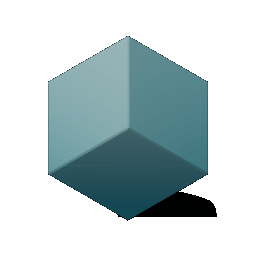
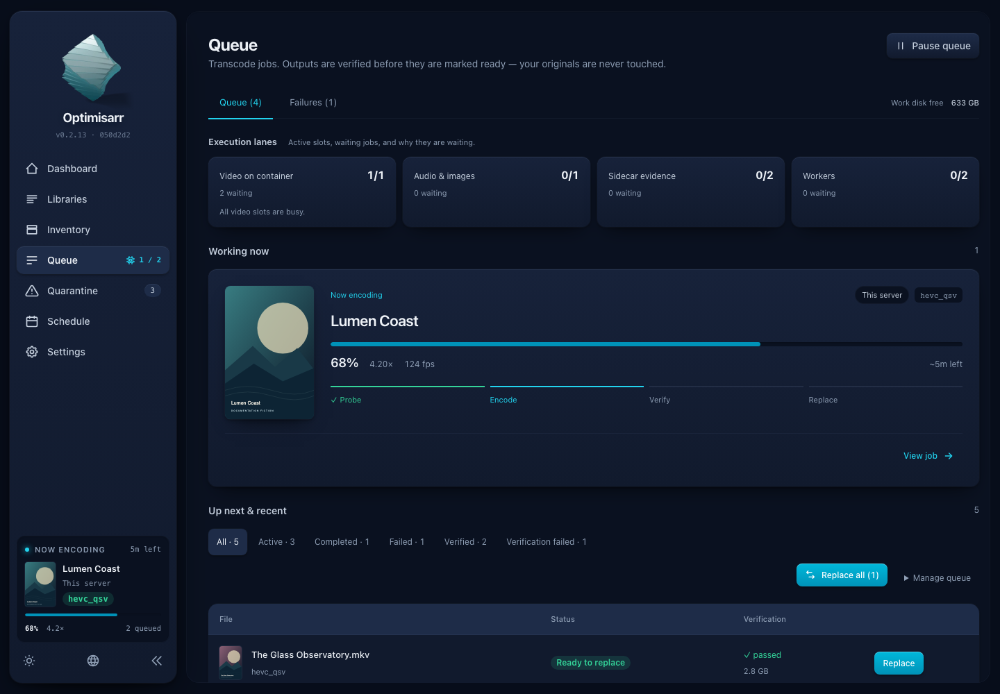

<p align="center">
  <picture>
    <source media="(prefers-reduced-motion: reduce) and (prefers-color-scheme: light)" srcset="sidecars/macos/Sources/OptimisarrSidecar/Resources/BrandMarkLight.png">
    <source media="(prefers-reduced-motion: reduce)" srcset="sidecars/macos/Resources/AppIcon.png">
    <source media="(prefers-color-scheme: light)" srcset="docs/images/optimisarr-precession-working-light.gif">
    
  </picture>
</p>
<h1 align="center">Optimisarr</h1>
<p align="center"><strong>Safe, verified FFmpeg transcoding for self-hosted media libraries.</strong></p>
<p align="center">
  <a href="#documentation">Docs</a> •
  <a href="#quick-start-docker">Quick Start</a> •
  <a href="#hardware-acceleration-gpu">Hardware Acceleration</a>
</p>
<p align="center">
  <a href="https://github.com/Jellman86/optimisarr" target="_blank" rel="noopener noreferrer">
    
  </a>
</p>
<p align="center"><sub>If Optimisarr is useful to you, starring the repo helps more people discover it.</sub></p>

**Optimisarr is a self-hosted, Docker-based FFmpeg media-library optimiser.**
It finds eligible video, audio, and image files, transcodes them to reduce
storage use, verifies the result, and only then replaces the original.

Built for Plex, Jellyfin, Emby, Sonarr, and Radarr users, Optimisarr supports
CPU, NVIDIA NVENC, Intel QSV, and VA-API transcoding. Originals are quarantined
for rollback rather than deleted immediately.

## Why Optimisarr?

- Reduce media-library storage without manually batch-transcoding files.
- Verify output before replacement, with configurable stream-retention,
  duration, and size-reduction checks.
- Run one Docker container on a homelab, Unraid-style server, or other
  self-hosted setup.
- Pause processing while Plex, Jellyfin, or Emby has active streams.
- Send video encoding and optional strict verification to paired Mac and Windows workers.

<p align="center">
  
</p>
<p align="center"><sub>All media shown in screenshots is fabricated test data created for documentation; no copyrighted material is used.</sub></p>

## Documentation

Start with the [documentation index](docs/index.md): [getting started](docs/setup/getting-started.md), [user workflow](docs/usage/workflow.md), [personal quality check](docs/usage/personal-quality-check.md), [configuration](docs/setup/configuration.md), [hardware acceleration](docs/setup/hardware-acceleration.md), [reverse proxy](docs/setup/reverse-proxy.md), [safe replacement](docs/operations/safe-replacement.md), [integrations](docs/integrations/media-servers.md), [troubleshooting](docs/troubleshooting/diagnostics.md), [known issues](KNOWN_ISSUES.md), [glossary](docs/glossary.md), [Code signing policy](CODE_SIGNING_POLICY.md), and [API reference](docs/api.md).

## Remote workers

Keep the container as the coordinator and use the [Mac menu-bar app](sidecars/macos/README.md)
or [Windows tray app](sidecars/windows/README.md) for video encoding. Both show live work,
resource readings and pause controls. Each library chooses whether to use the server, prefer a
worker, or wait for workers only. Optional strict worker verification also moves media checks
to compatible sidecars; scheduling, file transfer and safe replacement remain on the server.

See [worker setup and placement](docs/setup/remote-workers.md) and the
[release downloads](https://github.com/Jellman86/optimisarr/releases). The Mac download is signed
and notarised. Windows MSI downloads are currently unsigned previews, clearly labelled in their
release notes.

## Project status

Optimisarr is early-stage software. Use it on a small test set first and keep
backups of media you cannot replace. It is maintained in spare time, so there is
no support SLA or promise of a release schedule.

## What it does

- Multiple **libraries**, each with its own media type (Film/TV/Music/Photo/Other)
  and rule profile, with a folder-picker for paths. Scanning discovers the file
  types that match the library (video, audio, or images).
- Recursive, settling-aware **scanning** that builds a media inventory (idempotent),
  with **automatic background probing** of newly discovered files. Enabled libraries
  are rescanned on a configurable global interval (one hour by default).
- **ffprobe** inspection (codec, resolution, duration, tracks, media kind).
- Optimisation for **video, audio, and still images**, each through
  the same candidate → transcode → verify → quarantine/rollback pipeline.
- FFmpeg/ffprobe **tool detection**, liveness, and readiness endpoints. Docker
  health checks verify database access, required writable paths, and media tools.
- Svelte 5 + Tailwind **sidebar UI** (Dashboard, Libraries, Inventory, Queue,
  Quarantine, Schedule, Settings; Tools live under Settings). Verification reports
  are available in the Queue job dialog and the full-page Quarantine review.
- Queue resource controls: primary media slots, optional parallel audio/image and
  sidecar-evidence lanes, CPU thread limits, and a free
  work-disk safety pause. The only global scheduling setting is the library scan
  interval; *when* work runs is set per library (see auto-optimise below).
- Per-library **auto-optimise** windows continuously queue newly eligible files;
  opt-in **auto-replace** promotes only fully verified jobs, still quarantining
  the original first so rollback remains available.
- **Optimisation presets** per library (Compatibility H.264 / Balanced HEVC /
  Efficiency AV1 / Remux), plus **Scott's Settings** — HEVC with HDR tone-mapped
  to SDR and AAC 96 kbps audio downmixed to stereo. Optionally **re-encode oversized files already
  in the target codec** (e.g. a huge HEVC remux) above a size you set. Compatibility H.264
  is limited to proven 8-bit sources; higher or unknown bit depths are left untouched with guidance
  to use HEVC or AV1 instead.
- **Exclude files** so they are never optimised again — manually from a stuck Queue
  job, or **automatically after an unrecoverable or repeated failure** — managed per library on an
  **Excluded** tab. Durable (keyed by path) and reversible; originals untouched.
- A **Dashboard** leading with a persistent lifetime **space-saved** total (resettable),
  what's in flight, and live CPU/GPU usage while a job encodes.
- **Preview** from Inventory or a library's Candidates tab to try the resolved settings on one
  file before queueing it. Long video previews encode a 60-second sample from the middle of the
  source, verify against a temporary clipped reference from that same window, and label the report
  as segment-only. The original and encoded video players share that source-relative timeline, so
  play, pause, seek, rate changes, and drift correction remain frame-aligned while both real files
  retain native controls, fullscreen, and download access. Audio and image previews run in full.
- A per-library, full-page **Personal quality check** compares a marked original reference with the
  relevant anonymous candidates, then finds the most compressed setting the user
  classifies as indistinguishable or acceptable on their own equipment.
  Video compares the full library-slider presets across frame-aligned early/middle/late scenes
  (including fail-closed HDR handling), music uses level-matched excerpts, and still images keep
  zoom and pan synchronized. Results change only the saved preset/quality after an explicit Apply;
  no source is queued, replaced, moved, or deleted.
- Video replacement verifies the resolved codec, exact resolution, pixel bit depth, chroma sampling,
  and encoder profile in addition to full decode, timing, HDR/colour, stream, size, and VMAF gates.
- Music defaults to **AAC 128 kbps in M4A**, preserving common attached cover art, tags, and timed
  lyrics. Opus remains an efficient option for art-free libraries; incompatible artwork/lyrics
  combinations are rejected before queueing rather than being dropped or failing during muxing.
- Hardware capability detection for FFmpeg accelerators, CPU encoders, NVIDIA
  NVENC, Intel QSV, VAAPI, NVIDIA runtime, and `/dev/dri` mapping.
- Global encoder mode selection for Auto, CPU, NVIDIA NVENC, Intel QSV, and VAAPI.
- Per-library **Encoder effort** choices that resolve after the actual encoder is selected, mapping
  one portable Fast/Balanced/Efficient intent onto valid x264/x265, SVT-AV1, NVENC, or QSV presets
  while VAAPI safely retains its driver default.
- Per-library, media-aware verification gates for duration tolerance, stream
  retention, required size reduction, VMAF, audio fidelity, image SSIM, and metadata.

- **Hardware transcoding** through NVIDIA NVENC, Intel QSV, and Intel/AMD VA-API, with
  per-encoder availability **confirmed by a real test encode** (not just inferred), and the
  encoder used shown per job (GPU/CPU) on the Queue.
- **GPU hardware decoding** (NVIDIA NVDEC, QSV, and VA-API) of the source as well as the encode,
  on by default,
  with automatic CPU-decode fallback for sources the GPU can't decode — so a large 4K encode no
  longer burns a CPU core just on software decode. HDR→SDR jobs use the established software colour
  pipeline by default; an opt-in can use Intel QSV or VA-API tone mapping end to end for a freshly
  confirmed HDR10/PQ source, with one automatic software retry when the hardware filter cannot run.
- A **"now encoding" hero panel** with a live progress bar, fps/speed/ETA, and a **live CPU/GPU
  usage graph** while a job encodes (sampled with **unprivileged** reads only; no root or extra
  container capabilities). Click any job for a **detail view** showing the resolved encoder, the
  exact **FFmpeg command**, the verification report, and inline actions (retry, exclude, replace).
  The sidebar's Queue item throbs a **GPU chip** when work is hardware-accelerated or a **snail**
  when it's on the CPU, with a running-job count.
- Optional **service-activity pauses** (Plex/Jellyfin/Emby), **dry-run mode**,
  configurable replacement/quarantine policy with a retention window, and **library
  integrations** (Plex/Jellyfin/Emby re-scan, Sonarr/Radarr import-aware exclusions,
  webhook/Discord/Telegram/ntfy/Apprise notifications, config-and-secrets backup/import).

Still planned (see the [roadmap](docs/roadmap.md) and maintained
[hardware validation matrix](docs/setup/hardware-validation-matrix.md)): real-hardware validation
for AMD VA-API and NVIDIA NVDEC. Intel QSV has been tested on real hardware for both encoding and
decoding.

## Before you start

- Docker Engine with the Compose plugin.
- Read and write access to the media folders you mount into the container.
- One host storage root mounted at `/data`, with media, work, and quarantine beneath it, if you
  want atomic replacement moves.
- A backup of media that matters to you. Quarantine and rollback are useful,
  but they are not a backup strategy.

## Quick start (Docker)

The image is published to GHCR on every push to `dev`:

```bash
mkdir -p ./optimisarr-config /path/to/storage/{media,.optimisarr/work,.optimisarr/trash}
sudo chown -R 1000:1000 ./optimisarr-config /path/to/storage
```

```bash
docker run -d --name optimisarr \
  -p 8787:8787 \
  -e PUID=1000 -e PGID=1000 -e TZ=Europe/London \
  -e OPTIMISARR_ADMIN_TOKEN='change-this-long-random-token' \
  -e OPTIMISARR_WORK_DIR=/data/.optimisarr/work \
  -e OPTIMISARR_TRASH_DIR=/data/.optimisarr/trash \
  -v ./optimisarr-config:/config \
  -v /path/to/storage:/data \
  ghcr.io/jellman86/optimisarr:dev
```

Wait for readiness, then open the UI:

```bash
curl http://localhost:8787/api/ready
```

Open `http://localhost:8787`. A new database opens the resumable five-step setup, verifies the
mounted paths, free space, filesystem/mount relationships, permissions, and media tools. Missing
or inaccessible storage gets concrete Docker Compose, Unraid, TrueNAS, or local recovery steps and
a real Re-test action. Setup lets you fully configure as many libraries as needed and starts in
**Dry-run mode**. Completing setup never starts a scan or job; review each library’s Candidates,
then scan and queue a small test set deliberately. Use **Settings → Backup → First-run setup → Run
setup again** to revisit the guided checks without deleting existing configuration.
Add libraries from `/data/media`; the hidden work and quarantine directories remain below the same
container mount boundary.
Compose examples are available for every supported runtime:

- [CPU only](compose.cpu.example.yml)
- [NVIDIA NVENC](compose.nvidia.example.yml)
- [Intel QSV](compose.intel-qsv.example.yml)
- [Intel or AMD VA-API](compose.vaapi.example.yml)
- [combined reference file](compose.example.yml)

Keep media, work, and quarantine beneath one **container mount boundary** when possible so the
replacement pipeline can use atomic moves; separate bind mounts require the verified
cross-filesystem fallback. Do not publish `8787` directly to the
internet; use an authenticated reverse proxy for remote access. Setting
`OPTIMISARR_ADMIN_TOKEN` adds a built-in bearer-token backstop for the UI and API,
but a reverse proxy remains the recommended public-access boundary.

## Hardware acceleration (GPU)

Transcoding runs through a bundled **jellyfin-ffmpeg**, which includes FFmpeg support for NVENC and
VA-API plus the Intel iHD/oneVPL userspace stack. The host must still provide a compatible kernel
driver, device mapping, permissions, and (for NVIDIA) container runtime. The encoder is picked by
**Settings → General → Queue → Encoder mode** (Auto by default); **Settings → Tools** shows what
each GPU actually supports
(availability is confirmed by a real test encode), and each Queue job shows whether it ran on
the **GPU** or **CPU**. Perceptual quality measurement uses a separate, pinned static FFmpeg
with `libvmaf`; the Tools page reports that optional capability independently. An optional
`OPTIMISARR_FFMPEG_VMAF_CUDA` binary enables NVIDIA `libvmaf_cuda` when the build and runtime GPU
support it; QSV/VA-API can offload SDR decoding while scoring remains on the CPU, and every hardware
failure retries in software. New video re-encode libraries enable VMAF with the Visually lossless
target by default; remux and non-video libraries skip it, and existing libraries keep their saved policy.
The same editor presents two mutually exclusive video-quality paths: the default **Adaptive per-title
VMAF**, or **Fixed library quality**. Adaptive mode tests up to four encoder values across
bounded early/middle/late video-only samples before the full encode, then chooses the smallest
measured passing candidate. Adaptive preparation falls back to Fixed when evidence is unavailable
or contradictory and never replaces final verification. Fixed remains a one-click opt-out when the
extra measurement cost is not appropriate.
Model choice and measurement preparation are automatic: HDTV/4K selection, reference-resolution
bicubic scaling, source-cadence frame alignment, timestamp/timebase and colour-range alignment, and like-for-like HDR→SDR reference
tone-mapping require no libvmaf expertise. Optional early/middle/late sample scoring and 1–10 frame
subsampling reduce runtime; every-frame scoring remains the safest default. VMAF-only failures get
one encoder-aware higher-quality retry, then auto-exclude if that recovery still produces a measured
score below the gate; missing/unusable measurements fail closed without triggering that recovery.
An output that fails the size-saving gate auto-excludes immediately rather than silently lowering the
configured quality; combined size and VMAF failures do the same because the safe recovery directions
conflict. The report records the effective quality and sampling context.

When a hardware encoder is in use the source is **hardware-decoded** on the GPU too
(**Settings → General → Queue → Hardware decoding**, on by default), so transcode frames stay
on-device where the encoder supports it. If the GPU can't decode a particular source, the job
automatically retries with software decode rather than failing. The Queue detail view shows a live CPU/GPU usage graph while a job
runs — GPU stats are read **without any elevated privileges** (per-process DRM fdinfo for
Intel/AMD, `nvidia-smi` for NVIDIA), so **no extra container capability or compose change is
needed**; hosts where no unprivileged source applies simply show "GPU stats unavailable".

- **NVIDIA (NVENC/NVDEC):** install the [NVIDIA Container Toolkit](https://docs.nvidia.com/datacenter/cloud-native/container-toolkit/install-guide.html)
  on the host and run with `--gpus all`. You **must** also set
  `NVIDIA_DRIVER_CAPABILITIES=compute,video,utility` — the `video` capability exposes NVENC and
  NVDEC; without it encoding fails with `Cannot load libnvidia-encode.so.1` even though `nvidia-smi`
  works.
- **Intel (QSV / VA-API) and AMD (VA-API):** map the render node and add the container to the
  host's `render` group:

  ```bash
  docker run -d --name optimisarr \
    --device /dev/dri:/dev/dri \
    --group-add "$(getent group render | cut -d: -f3)" \
    ... ghcr.io/jellman86/optimisarr:dev
  ```

Use the matching Compose example: [NVIDIA NVENC](compose.nvidia.example.yml),
[Intel QSV](compose.intel-qsv.example.yml), or
[Intel/AMD VA-API](compose.vaapi.example.yml). A
[CPU-only file](compose.cpu.example.yml) is also provided.

## Development

Standards and commands live in [`CLAUDE.md`](CLAUDE.md). In short:

```bash
dotnet build Optimisarr.slnx      # backend
dotnet test  Optimisarr.slnx      # tests
cd web && npm run check           # frontend type/lint check
cd web && npm run dev             # frontend dev server (proxies /api to :8787)
```

## License

Optimisarr is licensed under the [GNU General Public License v3.0](LICENSE). The
published Docker image also bundles GPL-licensed FFmpeg distributions
([jellyfin-ffmpeg](https://github.com/jellyfin/jellyfin-ffmpeg) and
[static-ffmpeg](https://github.com/wader/static-ffmpeg)), which remain under their own licenses.

## Project references

- [Changelog](CHANGELOG.md)
- [Known issues](KNOWN_ISSUES.md)
- [Product and architecture](docs/product-and-architecture.md)
- [Roadmap](docs/roadmap.md)
- [Engineering standards](CLAUDE.md)
- [Security policy](SECURITY.md)
- [Support](SUPPORT.md)
- [Contributing](CONTRIBUTING.md)
- [Code of Conduct](CODE_OF_CONDUCT.md)
