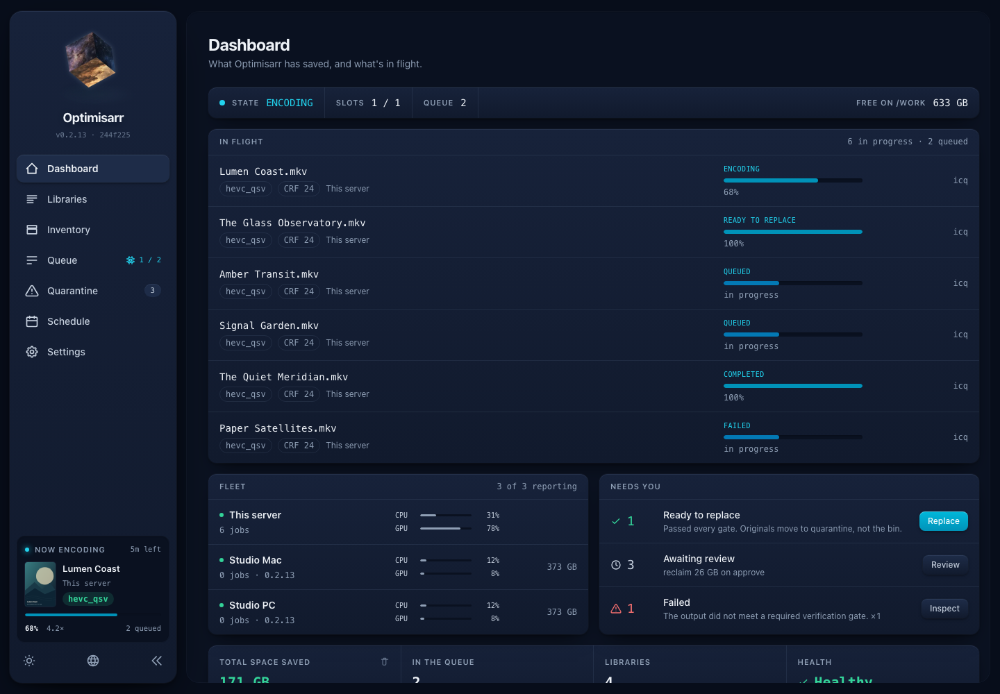

# Optimisarr documentation

Optimisarr is a safety-first media-library optimiser. It scans and queues work,
verifies each output, and keeps originals in quarantine until you approve purge.

## New users

- [Getting started](setup/getting-started.md) - deploy the container and run the first dry-run workflow.
- [User workflow](usage/workflow.md) - a friendly walkthrough of the app, from first library to quarantine review.

## Day-to-day operation

- [Choose a personal quality setting](usage/personal-quality-check.md) - run a blind video, audio, or image comparison for one library.
- [Safe replacement and rollback](operations/safe-replacement.md) - what has to pass before an original is moved, and how rollback works.
- [Configuration and scheduling](setup/configuration.md) - queue limits, verification gates, per-library automation, exclusions, and backup.
- [Remote workers and sidecars](setup/remote-workers.md) - install and pair Mac/Windows workers, choose placement, and require worker verification.
- [Hardware acceleration](setup/hardware-acceleration.md)
- [Run the NVIDIA quality comparison](setup/nvenc-quality-comparison.md) - create an anonymous NVENC benchmark report without changing the supplied clips.
- [Running behind a reverse proxy](setup/reverse-proxy.md)
- [Media-server integrations](integrations/media-servers.md) - Plex, Jellyfin, Emby, Sonarr, Radarr, and notifications.

## Reference

- [API reference](api.md) - HTTP endpoints used by the UI and local automation.
- [OpenAPI contract](openapi.json) - generated OpenAPI 3.1 document for API tooling.
- [Glossary](glossary.md) - Optimisarr terms in plain English.
- [Documentation standard](documentation-standard.md) - how project docs should be written and reviewed.
- [Product and architecture](product-and-architecture.md)
- [Roadmap](roadmap.md)

## Troubleshooting and project information

- [Troubleshooting](troubleshooting/diagnostics.md) - health/readiness, stalled jobs, failed verification, GPU detection, and stale UI.
- [Known issues](../KNOWN_ISSUES.md) - reproducible problems still present in the current release.
- [Security policy](../SECURITY.md)
- [Code signing policy](../CODE_SIGNING_POLICY.md) - signed Windows release scope, approvals, privacy and verification.
- [Support](../SUPPORT.md)
- [Contributing](development/contributing.md)
- [Writing a release](development/releasing.md) - the human-first GitHub Release standard and checklist.

## UI Map

| Screen | Use it for |
|---|---|
| Dashboard | Check service health, lifetime savings, queue counts, and live CPU/GPU usage while a job encodes. |
| Libraries | Add paths, choose presets, configure media-aware verification and automation, run a personal quality check, scan, enqueue, review candidates, and manage exclusions. |
| Inventory | Inspect discovered files and understand why each one is eligible or skipped. |
| Queue | Watch or manually pause jobs, read verification reports, retry or exclude failures, and replace verified outputs. |
| Quarantine | Compare replacements with originals, roll back, approve, or clear finished history. |
| Settings | Tune queue and hardware limits, replacement policy, integrations, notifications, tools, and backup/import. |

## A note on screenshots

Screenshots use fabricated dummy media created for documentation. No copyrighted material is
used. They are captured from the current local UI with original artwork and simulated API responses.
See [Screenshot capture](images/README.md) for the repeatable capture command and coverage.
