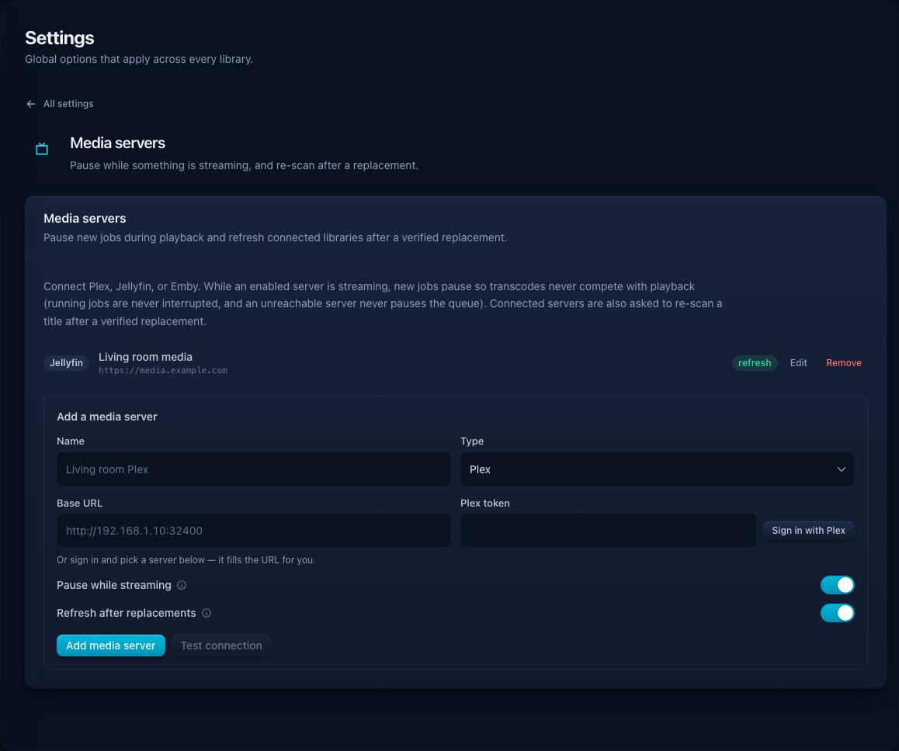
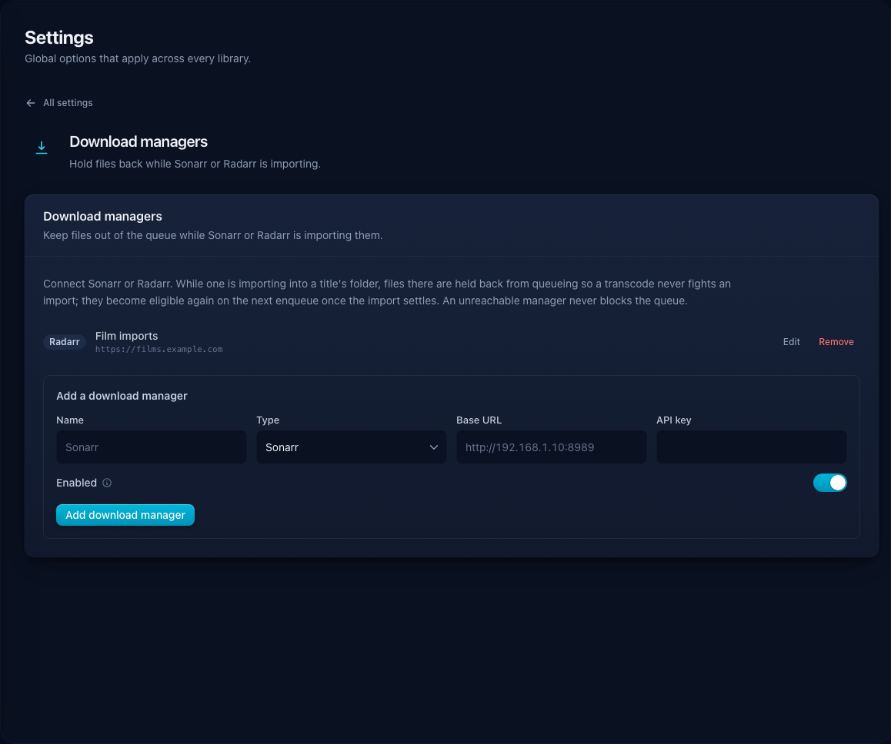

# Media-server integrations

Optimisarr supports configured Plex, Jellyfin, and Emby activity watchers to
pause new work while a service is active. Unreachable watchers do not wedge the
queue. After a replacement or rollback it asks each connected server to rescan:
a changed-folder refresh for Jellyfin/Emby, and a section refresh for Plex.

Configure Plex, Jellyfin, and Emby under **Settings → Media servers**. Configure Sonarr and
Radarr under **Settings → Download managers**.

Screenshots in this page use fabricated dummy media created for documentation.
No copyrighted material is used.

| Service | Use it for | Connection method |
|---|---|---|
| Plex | Pause new work during active sessions; refresh libraries after replacement or rollback. | Plex sign-in/PIN flow, then choose a discovered server or enter the URL manually. |
| Jellyfin | Pause new work during active sessions; refresh changed folders after replacement or rollback. | Quick Connect or API key. |
| Emby | Pause new work during active sessions; refresh changed folders after replacement or rollback. | API key. |
| Sonarr | Avoid immediately reprocessing recently imported TV files. | Base URL and API key. |
| Radarr | Avoid immediately reprocessing recently imported movie files. | Base URL and API key. |

Test each connection before enabling it. Keep only the pause and refresh
behaviour you actually need.

## Notifications

Notification targets live under **Settings → Notifications**. Supported targets
are generic webhook, Discord, Telegram, ntfy, and Apprise. Discord webhook URLs
are detected automatically and sent as embeds. Telegram sends through the official
Bot API and opportunistically includes artwork Optimisarr already knows: a film/TV
poster, embedded audio cover, or image thumbnail. Artwork lookup has a short budget;
if no suitable image is available or it is too large, Optimisarr sends plain text instead.
If Telegram explicitly rejects an uploaded image as invalid or unsupported, Optimisarr retries the
same notification as text. It does not retry ambiguous timeouts, rate limits, or server failures,
because the photo request may already have succeeded. Targets can notify on
replacement and on job failure. After saving a target, use **Test** to send a clearly
labelled test through that provider immediately. Optimisarr reports success or a short
failure reason inline.

### Telegram setup

1. Create a bot with [@BotFather](https://t.me/BotFather) using `/newbot`, and keep
   the generated bot token secret.
2. Start a private chat with the bot, add it to the target group, or add it to a
   channel with permission to post. Bots cannot initiate a private conversation
   before the user starts them.
3. In Optimisarr, choose **Telegram**, enter the numeric chat ID (for a private chat
   or group) or a public channel username such as `@my_channel`, then paste the bot
   token. For a numeric ID, send the bot a message and inspect `message.chat.id` in
   the official Bot API `getUpdates` response.
4. Choose whether the target receives replacement notifications, failure
   notifications, or both, then save it.

The token is write-only in the Optimisarr API and UI. Do not paste it into logs,
screenshots, support issues, or a notification target's Chat ID field. See
Telegram's official [BotFather guide](https://core.telegram.org/bots/features#botfather),
[`sendMessage` reference](https://core.telegram.org/bots/api#sendmessage), and
[`sendPhoto` reference](https://core.telegram.org/bots/api#sendphoto).

## Backup warning

Exported configuration includes provider secrets so it can restore a working
setup. Treat the JSON file as sensitive material and never commit or share it.
