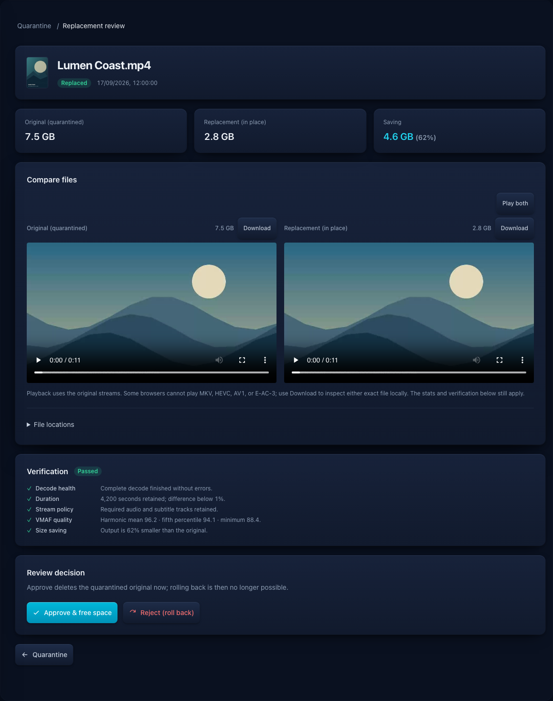
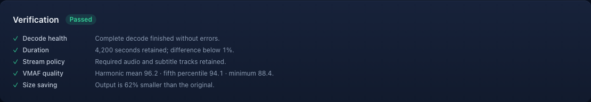

# Safe replacement and rollback

```text
scan → eligibility → queue → transcode in /work → verify → ready to replace
                                                        │
                                   manual replacement or opt-in auto-replace
                                                        │
original → /trash quarantine → verified output → library path
                                                        │
                                             approve purge or roll back
```

Before the first replacement, Quarantine is empty. Replaced originals appear
there for review and rollback.

Screenshots in this page use fabricated dummy media created for documentation.
No copyrighted material is used.


A clean FFmpeg exit never replaces an original by itself. Optimisarr probes and
verifies the output, including decode health, stream policy, duration, and the
configured saving requirement. Failed jobs leave originals untouched.

Replacement first records a pending rollback path in the database, then
quarantines the original, moves the verified output into its place, and validates
the final path. If the process stops between those steps, startup recovery uses
the pending record to restore the original or finish the already-completed
replacement before queue processing resumes. Same-filesystem paths use atomic
moves; cross-filesystem copy-plus-delete is an opt-in fallback.

Auto-replace is per-library, disabled by default, and runs only after every
verification gate passes. It does not bypass quarantine or rollback.

Dry-run mode is global. When enabled in **Settings → Files & safety → Replacement and cleanup**, Optimisarr
still scans, queues, transcodes, and verifies, but replacement and quarantine
purge actions are refused. Verified outputs stop at **Ready to replace** so you
can review the exact work that would have been applied. The timed cleanup may
still remove expired failed outputs from `/work`; it retains their diagnostic
records and never touches an original.

In **Quarantine**, open an entry to use its full-page review with a breadcrumb back to the list.
Compare the original and replacement players, sizes, and verification report. Reject a replacement to restore the original or approve it to
allow purge. Once an original is purged, Optimisarr cannot restore it; keep an
independent backup for media that cannot be replaced.





Rollback stages the optimised file before restoring the quarantined original. If
the restore fails, the optimised file is put back at the library path and the
replacement remains available for another rollback attempt.

## What can be safely cleared

- **Queue → Clear errored** removes failed/cancelled queue entries and any retained
  `/work` outputs; originals are untouched. This also removes their diagnostic rows.
- **Queue → Clear completed** removes completed queue entries only.
- **Queue → Clear pending** removes queued and ready-to-replace work and stops
  running jobs; originals are not touched, but verified outputs are discarded.
- **Quarantine → Clear finished** removes history rows for already purged or
  rolled-back entries; it does not touch active files.
- **Approve** permanently deletes a quarantined original. Do this only after
  reviewing the replacement.

The **Cleanup retention** setting applies to both quarantined originals and failed
outputs under `/work`. Every six hours, and once at startup, expired files are
removed. Failed-job reports and FFmpeg logs remain after their scratch output is
deleted. A value of `0` disables timed deletion for both. **Clean up now** previews
the eligible files and bytes, then runs the same policy after confirmation. It does
not purge quarantined originals in dry-run mode or remove files inside the retention
window.

Dry-run mode blocks replacement and purge actions. It does not block scanning,
probing, preview, transcoding, verification, retry, or rollback records that
already exist.
