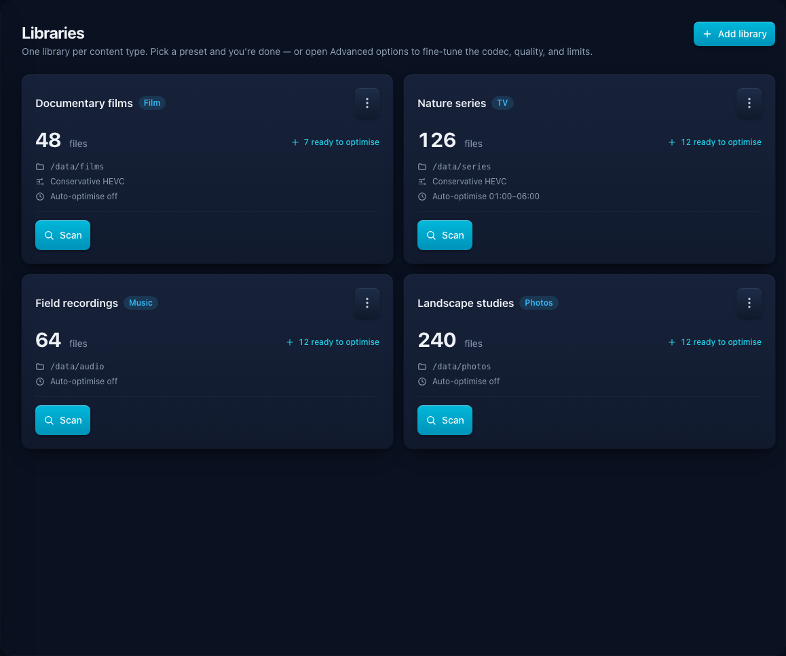

# Getting started

Optimisarr runs as one container. It persists SQLite state in `/config`. The supplied Compose files
mount one storage root at `/data`, read libraries from `/data/media`, and keep work and quarantine
under `/data/.optimisarr` so replacements can use atomic moves.

Use a small test library first. Optimisarr is designed to avoid replacing an
original unless a verified output exists, but it is still software operating on
your media paths.

Screenshots in these docs use fabricated dummy media created for documentation.
No copyrighted material is used.

## Deploy

Pick the Compose file that matches the host:

- [`compose.cpu.example.yml`](../../compose.cpu.example.yml) for CPU-only systems.
- [`compose.nvidia.example.yml`](../../compose.nvidia.example.yml) for NVIDIA NVENC.
- [`compose.intel-qsv.example.yml`](../../compose.intel-qsv.example.yml) for Intel QSV.
- [`compose.vaapi.example.yml`](../../compose.vaapi.example.yml) for Intel/AMD VA-API.
- [`compose.example.yml`](../../compose.example.yml) as a commented reference file.

Copy one to `compose.yml`, edit the host paths, then create the mounted folders
with ownership matching the `PUID`/`PGID` you configured:

```bash
mkdir -p ./config /path/to/storage/{media,.optimisarr/work,.optimisarr/trash}
sudo chown -R 1000:1000 ./config /path/to/storage
```

Start the container and wait for readiness:

```bash
docker compose up -d
curl http://localhost:8787/api/health
curl http://localhost:8787/api/ready
```

The first command confirms the web process is alive. The readiness endpoint
additionally confirms that the database, FFmpeg/ffprobe, and required writable
paths are available; wait for it to succeed before using the queue.

Keep media, work, and quarantine below one container mount boundary when possible so replacement
can use atomic moves. Separate bind mounts require the verified cross-filesystem replacement option.
The setup wizard reports the effective relationship rather than inferring it from host path names.
Ensure `PUID` and `PGID` can write every configured path.

Do not publish `8787` directly to the internet. For remote access, put Optimisarr
behind an authenticated reverse proxy; see [reverse proxy](reverse-proxy.md).



## First workflow

1. Enable **Dry-run mode** in **Settings → Files & safety → Replacement and cleanup**.
2. Add a library below `/data/media` and select its media type and rule profile.
3. Scan it; newly found files are probed in the background.
4. Review the explicit eligibility reason in **Inventory**.
5. Use **Preview** on one representative file to compare the original with the encoded result.
   Long video previews use a 60-second middle sample and label the verification report as
   segment-only; full queue jobs still encode and verify the whole file.
6. Queue a small test set and inspect its verification report.
7. Disable dry-run only after the reports look right, then replace outputs you
   have reviewed. Originals remain in **Quarantine**
   until approved or retention purges them.

Set **Cleanup retention** after choosing how long you need for rollback and failed-output
inspection. The same window applies to quarantined originals and failed `/work` outputs;
`0` keeps both indefinitely.

After that manual test, optional **Auto-optimise** and **Auto-replace** settings
can automate the same workflow per library. See [configuration and scheduling](configuration.md)
before enabling either one.

For a page-by-page walkthrough with screenshots, see the [user workflow](../usage/workflow.md).

## What to back up

Back up `/config/optimisarr.db` for Optimisarr state and keep independent media
backups for anything irreplaceable. `/data/.optimisarr/trash` contains rollback originals after
replacement, but entries can be approved or purged by retention policy.
