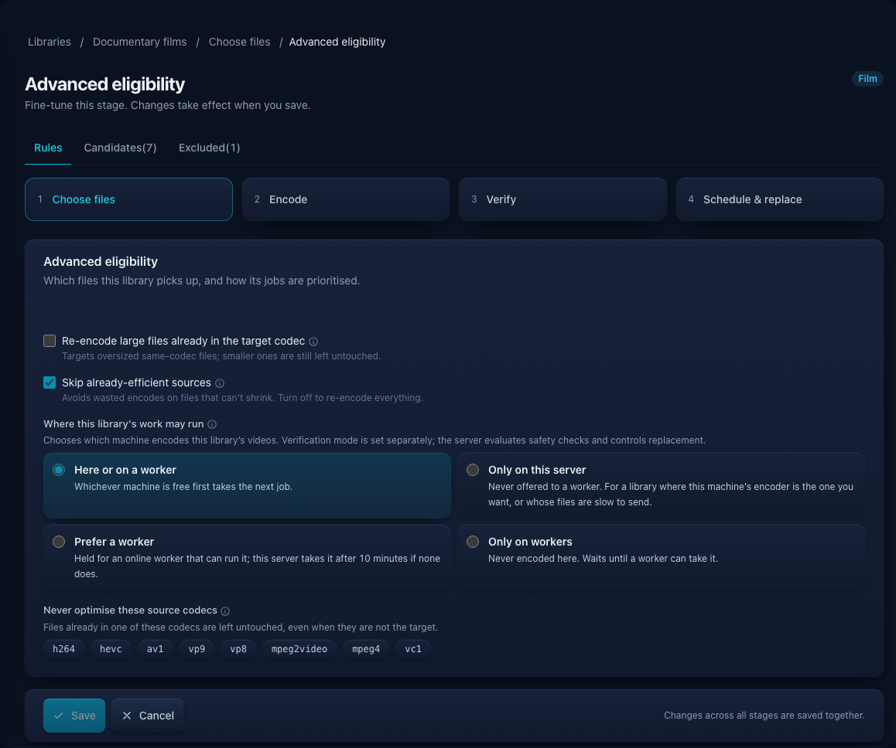
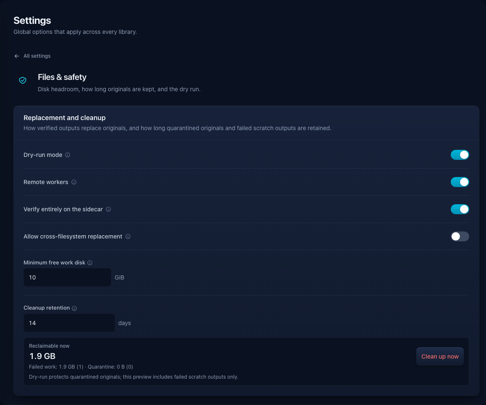

# Remote workers and sidecars

Optimisarr can send video re-encodes to a paired Windows PC or Apple Silicon Mac. The container
keeps the library, job history, and authority to replace or roll back files. Workers use their own
scratch space and return candidates and measurements; they cannot modify your originals.

Remote workers remain an opt-in preview. A single container is still the default installation.

Screenshots use fabricated dummy media created for documentation. No copyrighted material is used.

## Enable and pair

1. Set `OPTIMISARR_EXPERIMENTAL_REMOTE_WORKERS=true` in the container environment and deploy it.
2. Open **Settings → Files & safety** and enable **Remote workers**, then save.
3. Open **Settings → Remote workers** and issue a pairing code.
4. Install the sidecar and enter the server URL and code. The code expires after five minutes,
   can be used once, and is invalidated after five wrong guesses.
5. Confirm the machine is online and has proved the encoder needed by your library. Advertised
   hardware is checked with real test encodes; the presence of a GPU alone does not qualify it.

Use the [Mac installation guide](../../sidecars/macos/README.md) or the
[Windows MSI guide](../../sidecars/windows/installer/README.md) for platform requirements,
installation, upgrades, and packaging/signing status. Windows installs a background service and
tray companion. The Mac runs from the menu bar. Both expose a compact current-work monitor,
processing details, pause, preferences, and diagnostics.

Closing either monitor keeps work running. Quitting the Windows tray leaves its service running;
quitting the Mac app returns its held jobs. **Pause new jobs** lets held jobs finish and resets
when the worker/app restarts. A server-requested **Drain** also stops new claims while existing
leases finish; use it before an update and resume the worker afterward.

## Choose where a library runs

Open **Libraries → Configure → Choose files → Advanced eligibility → Where this library's work
may run**. Placement is saved per library and applies to eligible video re-encodes.

| Setting | Effect |
|---|---|
| **Here or on a worker** | Either the container or a compatible worker can claim the job. |
| **Only on this server** | Encode on the container. |
| **Prefer a worker** | Give an online, non-draining worker first opportunity, then allow the container after up to ten minutes. The waiting window starts when the job becomes eligible to run, not when it was queued. |
| **Only on workers** | Wait for a compatible worker; do not fall back to a local video encode. |

Turning **Remote workers** off makes placement fall back to the container, including libraries
saved as **Only on workers**. Keep remote workers enabled to enforce worker-only placement.
Automation windows, pause rules, capability requirements, and disk checks still apply. Audio-only,
image, preview, and personal quality-check workflows retain their existing local paths.

Queue shows separate capacity for video work, audio/images, sidecar evidence checks, safe
replacement, and workers. A strict worker result waits for the container to validate its evidence;
the container does not repeat media verification. **Settings → Encoding & queue → Advanced →
Workload concurrency** shows the effective limits and lets you set extra lightweight lanes when
the server has capacity. The primary video limit remains separate from each worker's advertised
slots. Queue names the waiting lane and its reason when work cannot start yet.

## Require all verification on the sidecar

**Verify entirely on the sidecar** is on by default for fresh installations once remote workers
are enabled. Existing installations retain their saved or previous value. You can change it under
**Settings → Files & safety → Remote workers**; changes apply to newly issued assignments. Updated sidecars
negotiate protocol 2 on heartbeat; they do not need a new pairing. Older workers cannot claim an
assignment that requires full verification.

The worker performs both media probes, the complete candidate decode, packet-timestamp checks,
VMAF when required, and requested audio loudness/true-peak measurements. The server validates the
contract, source/candidate hashes, evidence, and configured policy before a candidate can become
ready to replace. Missing, malformed, or mismatched evidence fails the job. Strict verification
never silently repeats those media-tool checks on the container.

Combine this setting with **Only on workers** to keep the applicable video encode and verification
media processing on workers. It does **not** make the server idle: scanning and initial probes,
assignment/filter preparation, file transfers and hashing, database updates, policy evaluation,
replacement, quarantine, and rollback remain on the container.

If you deliberately turn strict verification off, a worker can still return requested VMAF measurements to save the
server that pass. The container repeats the remaining verification checks and measures VMAF
itself if the returned quality evidence cannot be used.

## If a worker stays idle

- Check **Settings → Remote workers** for its last check-in, drain state, capabilities, held jobs,
  and last problem. Workers normally check in every 30 seconds and become offline after two
  minutes without a heartbeat.
- Check that the library is eligible, its automation window is open, and its placement permits a
  worker. A worker that cannot satisfy the encoder or verification contract receives no job.
- Open **Diagnostics** in the sidecar for local connection or tool problems. Low media-engine
  activity is not the same as low CPU/GPU activity; macOS does not report VideoToolbox engine use.
- Compare the installed sidecar version with the release's requirements. For strict verification,
  update both the app and its bundled media tools using that platform's package.

The [acceptance guide](../development/media-acceptance.md) describes isolated end-to-end checks
with freely licensed media. Dated [strict-verification evidence](../engineering/hardware-validation/2026-09-17-strict-sidecar-verification.md)
records the hardware and formats actually tested; it does not certify every GPU or HDR workflow.
