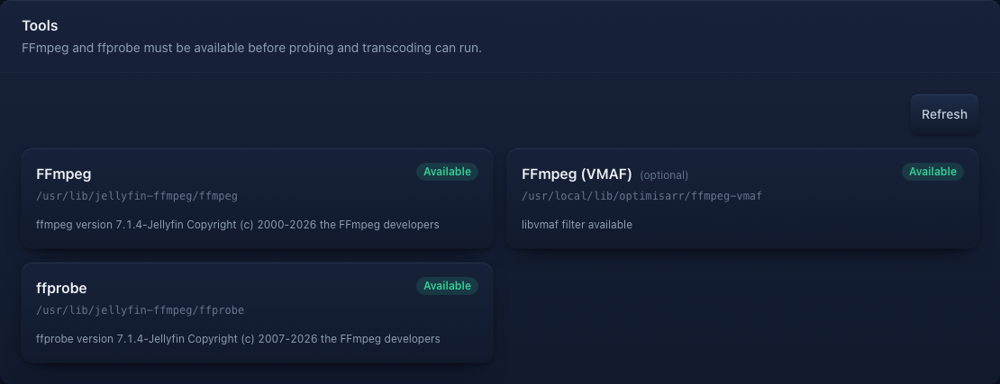

# Troubleshooting

## Start with health and logs

```bash
# Liveness: the web process is responding.
curl http://localhost:8787/api/health

# Readiness: SQLite, required writable paths, FFmpeg, and ffprobe are usable.
curl http://localhost:8787/api/ready
docker compose logs --tail=200 optimisarr
```

`/api/ready` returns `503` with a reason when Optimisarr cannot safely start
work. Check the reported path ownership/mount, database, or missing tool before
placing jobs in the queue. Docker's health check uses this readiness endpoint.

Use **Settings → System → Tools** to verify the required FFmpeg/ffprobe executables, the optional
`libvmaf` measurement capability, and the actual encoder test result. For a failed job,
open Queue details and read the FFmpeg error and verification report before retrying.
The Queue **Failures** tab and `GET /api/jobs/failures` also include failed preview and personal
quality comparisons. Each sample identifies its job type and returns structured failed verification
checks with the measured detail; closing the comparison removes its media but retains that small
diagnostic row until **Clear errored** is used.

Screenshots in this page use fabricated dummy media created for documentation.
No copyrighted material is used.



## Collect a job diagnostic bundle

Open **Settings → System → Diagnostic capture** before reproducing a problem. Choose
**1 hour**, **24 hours**, **7 days**, or **Until stopped**. Enter a job ID to limit
the capture to one job; leaving it empty records job transitions across the
queue. **Include full media paths in the export** is off by default. Start the
capture, reproduce the issue, then select **Stop capture**. Enter the job ID
under **Job ID to export** and select **Download diagnostics**. The JSON file
contains the selected job's server-held state transitions, attempt summaries,
worker leases, and verification summaries.

The capture is off until you start it. Each session records at most 10,000
enhanced events. Ended sessions and their events are removed after seven days;
sessions containing a recorded failure remain for 30 days. An **Until stopped**
session stays active across restarts until you stop it. You can still download
a stopped session until retention removes it. The export omits raw FFmpeg logs,
commands, stored credential fields and media content. Sidecar-local diagnostic logs are not
yet collected; the bundle's manifest names that omission. If you opt in to
full paths, review the file before sharing it publicly.
Bundles also bound historical attempts, worker leases and verification check
summaries; the manifest reports when older records were omitted.

This is an administrative feature. Protect remote access to the UI/API with an
authenticated reverse proxy or the admin token. A bundle may still reveal
technical information about your server and media policy, even without paths.

## Common causes

| Symptom | Check |
|---|---|
| `/api/ready` returns `503` | Read the JSON reason first. It usually points to an unwritable `/config`, `/work`, or `/trash` mount, a database migration/open failure, or missing FFmpeg/ffprobe. Fix readiness before queueing jobs. |
| Library cannot scan | Container path exists below `/data`; PUID/PGID can read it. |
| Replace fails / "cannot write" | The library folder must be writable by PUID/PGID. Optimisarr checks access when you add or save a library and again during scans; check the reported error and the mount ownership. |
| Replace/approve says dry-run mode is enabled | Dry-run mode is on under **Settings → Files & safety → Replacement and cleanup**. Jobs can still transcode and verify, but originals and quarantined originals are not moved or purged until dry-run is disabled. Expired failed `/work` outputs can still be cleaned because originals are untouched. |
| Jobs do not start | A library's auto-optimise window being closed (its jobs only run in-window), the concurrency limit, activity pause, or free `/work` space. The Queue shows a reason when a backlog is waiting on a window. |
| `/work` keeps growing | Set **Cleanup retention** above `0` and save. The panel shows what is currently reclaimable; **Clean up now** runs the same policy after confirmation. The startup/six-hour sweep also removes expired failed outputs while preserving their job reports and logs. Active and ready-to-replace outputs are never removed. |
| GPU mode unavailable | Device mapping/NVIDIA toolkit, group permissions, then Tools test encode. |
| Replacement cannot be atomic | Put `/data`, `/work`, and `/trash` on one filesystem or explicitly allow fallback. |
| No rollback available | Original may have been approved or purged by retention; restore from backup. |
| Config import is rejected | The import validates the whole JSON before writing. Check the listed field errors, especially unsupported settings from a newer build, invalid enum names, and auto-enqueue windows that are not `HH:mm`. |
| UI looks stale after updating the image | Refresh the browser tab first; `index.html` is served no-cache, but an already-open SPA can still be running old JavaScript until it reloads. If it persists, confirm the container was recreated and `docker compose logs --tail=200 optimisarr` shows the new startup. |

## Verification failures

Verification failures mean the original is still in place. Read the Queue detail
sheet before retrying:

- **Duration**, **tail integrity**, or **timestamp integrity** failures usually
  indicate a truncated or malformed output. In a personal quality check, inspect the structured
  failure details: the reference and candidate should describe the same requested sample window.
- **Audio retained**, **subtitle retained**, **A/V sync**, **loudness**, and
  **true peak** failures indicate stream or audio changes outside the configured
  policy. Preview and Personal quality video candidates are exactly trimmed after
  their bounded seek, so a remaining A/V sync failure is not accepted as ordinary
  long-GOP pre-roll.
- **Size reduction** failure means the output was not smaller than the original.
  Either leave the file alone or change the library rules deliberately.
- **VMAF** failures come from the video re-encode quality gate (enabled at the Visually lossless tier
  for new video re-encode libraries and configurable on the library page); image **SSIM/metadata** failures come from the default-on
  image gates. When a gate is enabled, a missing measurement fails closed, but an unmeasured VMAF
  result does not trigger a higher-quality re-encode or immediate automatic exclusion.
- **Source video timeline** means the original's primary audio materially outlasts its picture
  packets. Optimisarr leaves that source untouched and reports the inherited gap separately from an
  output-tail truncation. Subtitle, chapter, data, and attachment timelines do not trigger this
  failure because they may legitimately continue beyond the programme.

Use **Retry** only after changing the underlying cause: preset, hardware mode,
source file, mount access, or verification policy. Use **Exclude** for files you
do not want Optimisarr to offer again.
