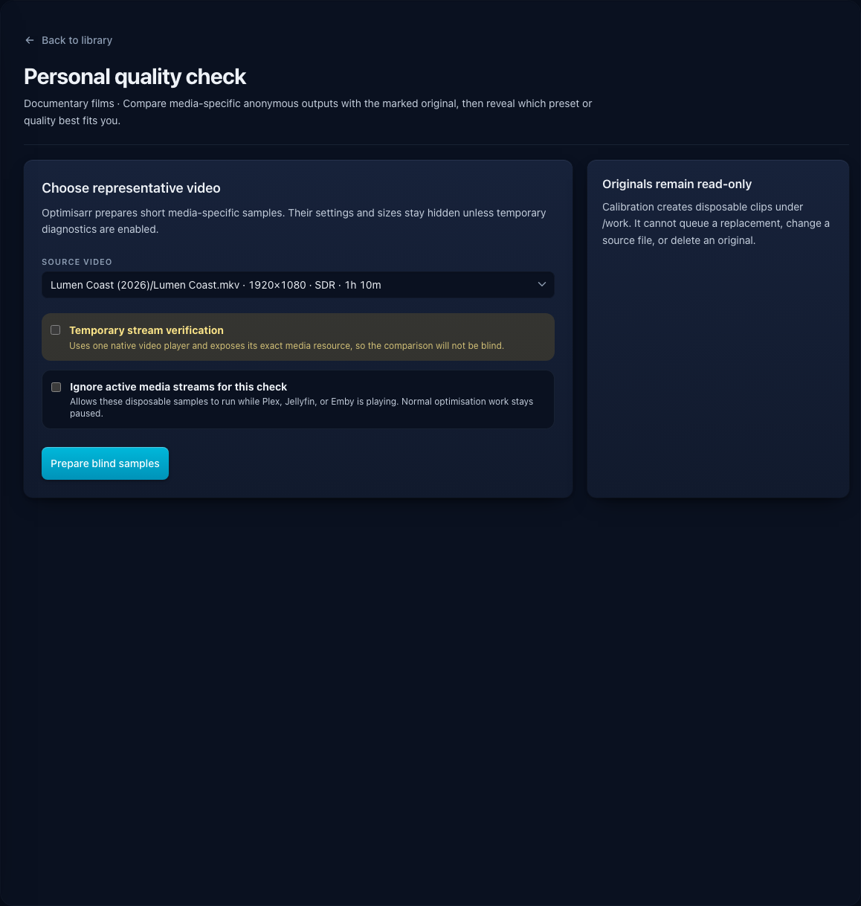
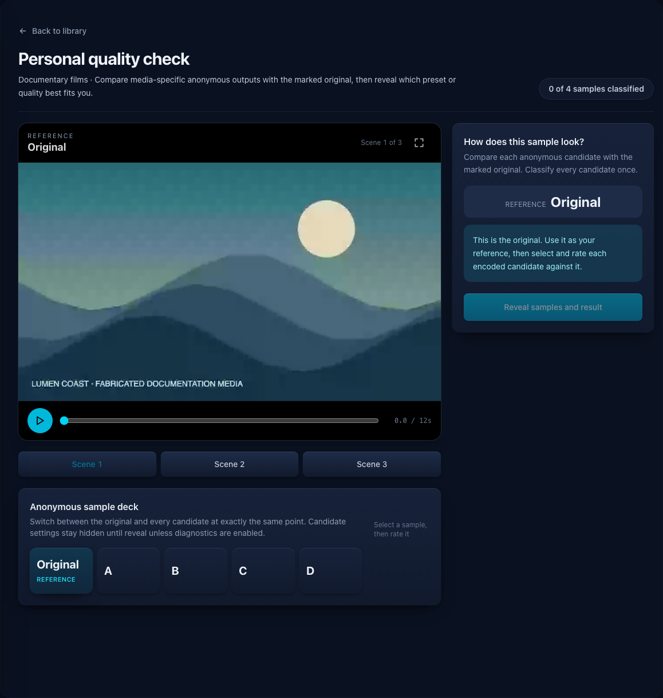
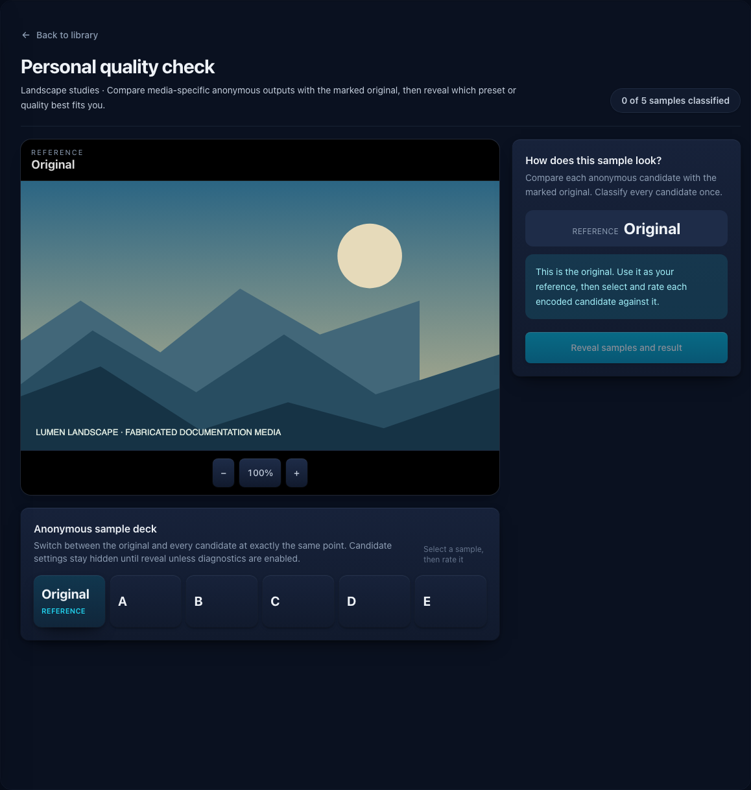

# Choose a personal quality setting

The **Personal quality check** is a full-page quality lab for finding the most space-efficient video
quality, audio bitrate, or image quality that still looks or sounds acceptable on your own equipment.
It is a personal calibration aid, not proof that two encodes are identical. Repeat it with several
representative sources before treating one result as a rule for a varied library.

Screenshots use fabricated dummy media created for documentation. No copyrighted material is used.

## Before you begin

You need a saved Film, TV, Music, Photo, or Other library; a scanned and probed source; enough free
space under `/work`; and the display or listening equipment you normally use. Video and audio sources
must be long enough for three excerpts. Animated images and Dolby Vision video are not offered.

The source remains read-only. Optimisarr creates disposable jobs under `/work/calibration`; they
cannot replace, move, or delete media and do not appear in the normal Queue.

## Start a check

1. Open **Libraries**, configure a saved library, and select **Personal quality check**.
2. The dedicated quality-lab page opens. Choose a representative source containing the motion,
   texture, fine detail, ambience, or tonal range you care about.
3. Select **Prepare blind samples**.

By default, preparation waits while a configured Plex, Jellyfin, or Emby watcher reports active
playback. Select **Ignore active media streams for this check** if you want this disposable check to
run anyway. The exception applies only to jobs created by this quality-check session; normal
optimisation work remains paused. Encoding can still compete with playback for CPU, GPU, and disk
bandwidth, so use the option only when that trade-off is acceptable.

Optimisarr prepares one unmodified reference and the candidates relevant to that media type. Video
uses the four complete named video preset outputs; audio and still images use five-setting quality
ladders. It structurally verifies every candidate before the comparison becomes available. For HDR
video, preparation also requires Preserve HDR handling, a browser-reported HDR display path, and
your confirmation that the intended display is actually presenting HDR.

Each video candidate starts from that named preset's complete server-owned bundle: video codec,
container, HDR handling, video-audio codec and bitrate, and stereo downmix policy. Settings stored
for the library's current preset do not carry into a different candidate. Optimisarr can still
safely change the final container when retained streams require it—for example, an MP4 preset falls
back to MKV rather than discarding Blu-ray/DVD image subtitles. The revealed diagnostics report the
format that was actually produced.

Each video preset uses its concrete configured quality for all three scenes. A library configured
for **Adaptive per-title VMAF** still uses adaptive selection for normal optimisation jobs, but the
personal check does not start another early/middle/late quality search inside every comparison
scene. That would change the preset being judged and multiply a short check into dozens of unrelated
sample encodes. Optimisarr instead measures VMAF on each completed 12-second scene and reveals that
objective evidence only after you classify the anonymous candidates.

Video scene positions come from a fresh probe of the primary picture stream, not the outer
container. This matters for Matroska sources whose subtitles or attachments continue after the
programme. Each candidate uses a bounded coarse seek followed by an exact trim, keeping copied audio
and subtitles on the same requested clock as the re-encoded picture without decoding from the start
of a long file.

Preparation progress is session-wide and monotonic: FFmpeg may move between probe, encode, and
verification stages, but the displayed percentage never moves backwards.

## Compare candidates with the original

The original is clearly marked as the fixed reference. Encoded candidates are shuffled and labelled
only with letters. Their settings, encoder, bitrate, and estimated saving normally remain hidden.
The optional **stream verification** switch is off by default so the check remains blind. Turn it on
only when you need to prove which file the browser is playing. For video, it uses one native browser
player and changes that element's media resource on every selection. Native controls, the element's
resolved `currentSrc`, and **Open exact resource in browser** let you confirm the browser requested
and opened the selected stream. This deliberately reveals the active preset and format.

- Switch between **Original** and the lettered candidates while examining the same moment. Video and audio keep one shared relative
  position, and a switch is not shown until the destination stream has sought to the matching frame.
- Video provides three scene tabs, a shared 0–12-second timeline, native controls while verification
  is enabled, and real browser fullscreen. The width-driven grading viewport remains contained on
  phone and short-landscape layouts; fullscreen expands that same media stage.
- Audio provides three 15-second excerpts. Optimisarr measures the reference and all five candidates using EBU R128
  integrated loudness and attenuates each to the quietest one so volume cannot reveal a version.
- Still images use one viewport. Zoom or drag to inspect detail; zoom and pan remain unchanged while
  switching between the reference and candidates.

Classify every candidate as **Indistinguishable**, **Acceptable**, or **Visibly worse** relative to the original.
Selection and rating use separate, full-size buttons for mouse, keyboard, and touch. There are four
video classifications or five audio/image classifications—no repeated trial loop and no rating for the original.

## Reveal and apply the result

After every candidate is classified, select **Reveal samples and result**. Optimisarr then shows
the setting behind every candidate, your classifications, estimated
savings, and the most compressed candidate you considered Indistinguishable or Acceptable. If every
candidate was Visibly worse, it recommends keeping the current setting.

**Use this quality for the library** selects the saved video preset and its complete current
codec/container/HDR/video-audio/downmix bundle, audio bitrate, or image quality. It does not scan,
enqueue, replace, move, or delete media. Optimisarr refuses a stale result
if the relevant library codec, preset, or quality changed during the session.

## What each media type tests

| Media | Prepared comparison | Applied setting |
|---|---|---|
| Video | One frame-aligned original plus the four complete library-slider presets across three 12-second scenes. | Video rule preset. |
| Audio | One lossless reference plus five codec-appropriate bitrates across three level-matched 15-second excerpts. | Audio bitrate in kbps. |
| Still image | One lossless PNG reference plus five output-quality levels in a synchronized zoom/pan viewport. | Image quality. |

## If the check cannot continue

| What you see | What to do |
|---|---|
| **Personal quality check** is disabled | Save or discard the library's unsaved changes first. |
| No suitable source is ready | Scan and probe the library, then choose a long enough video/audio file or a non-animated image. |
| HDR viewing check blocks preparation | Use an HDR-capable browser/display and keep the library's HDR handling set to Preserve. |
| Preparation fails | Check `/work` space and permissions, then **Settings → System → Tools** for encoder availability. |
| A comparison stream cannot play | Return to the library and retry with a supported browser, codec, or source rather than guessing. |
| A/V sync fails | The prepared candidate exceeded the strict sync tolerance after exact clipping; inspect its structured failure rather than rating a desynchronised sample. |

For video sources above 8-bit, the quality check omits Compatibility H.264 because H.264 High 10 is
not the preset's broad 8-bit playback target. The HEVC, AV1, and Scott's Settings candidates remain
available and preserve the source bit depth.

Leaving the quality lab removes its session and scratch media. Abandoned sessions expire after two
hours, and restarting Optimisarr discards all remaining sessions. See the
[API reference](../api.md#personal-blind-quality-calibration) for the HTTP contract.
