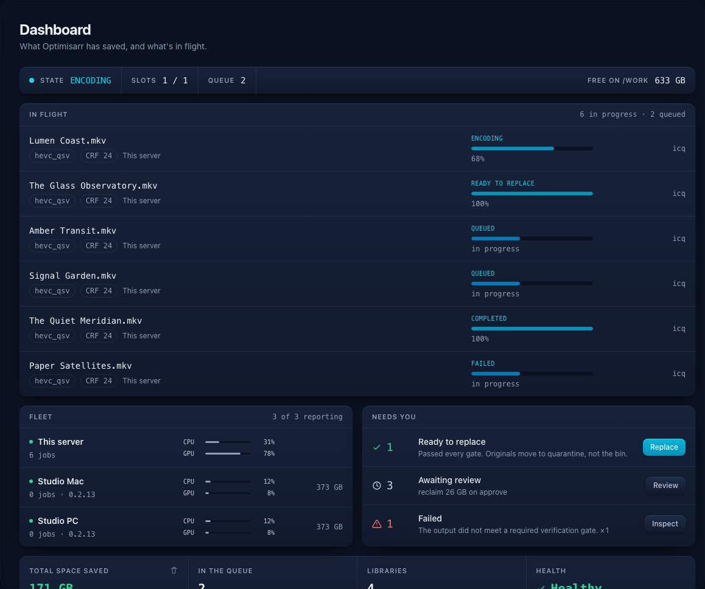
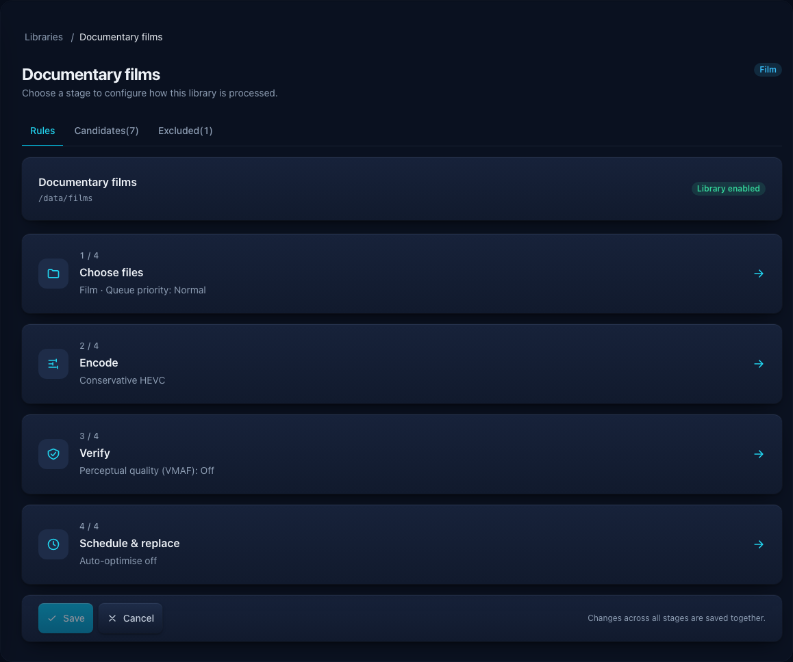
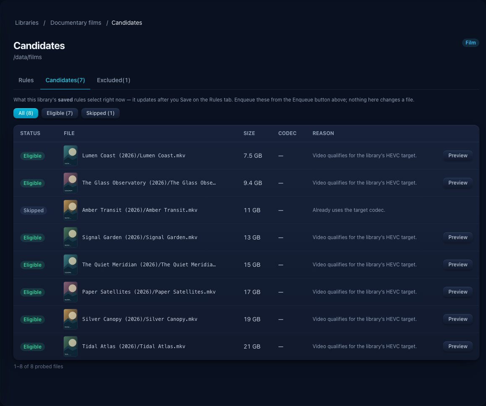
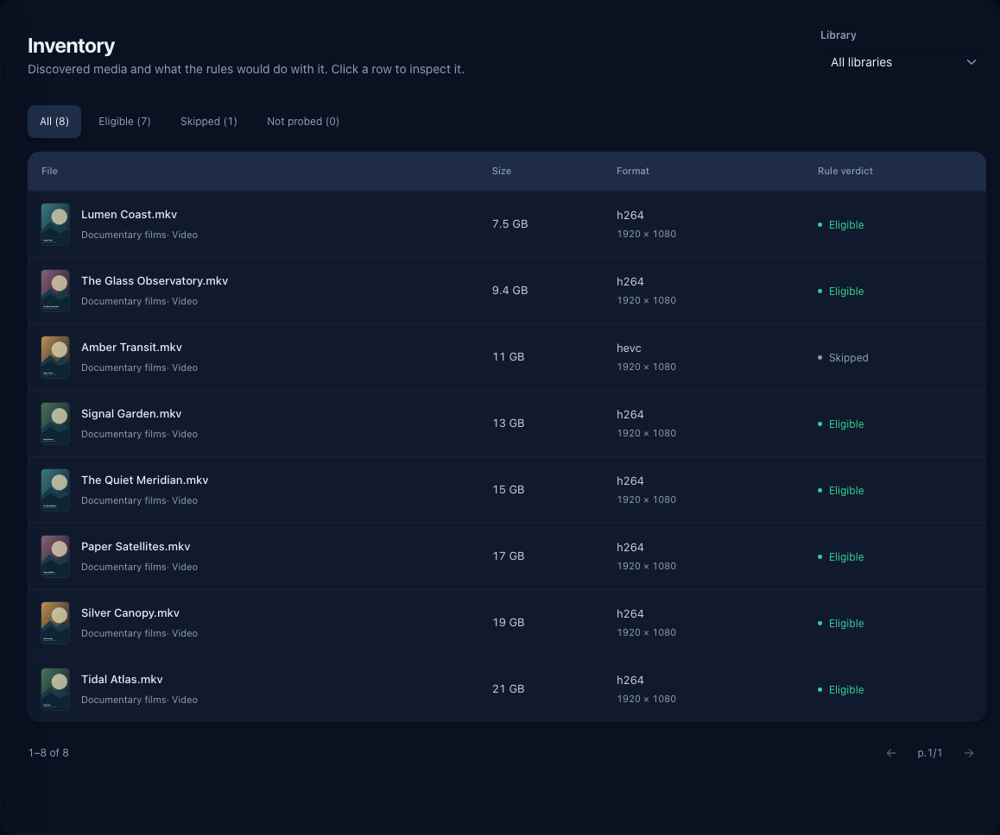
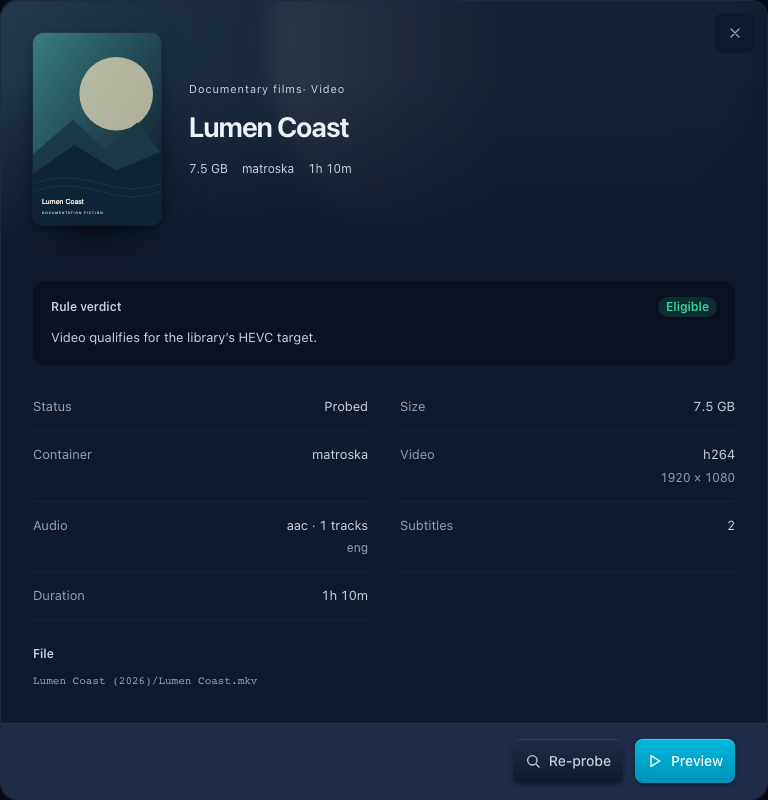
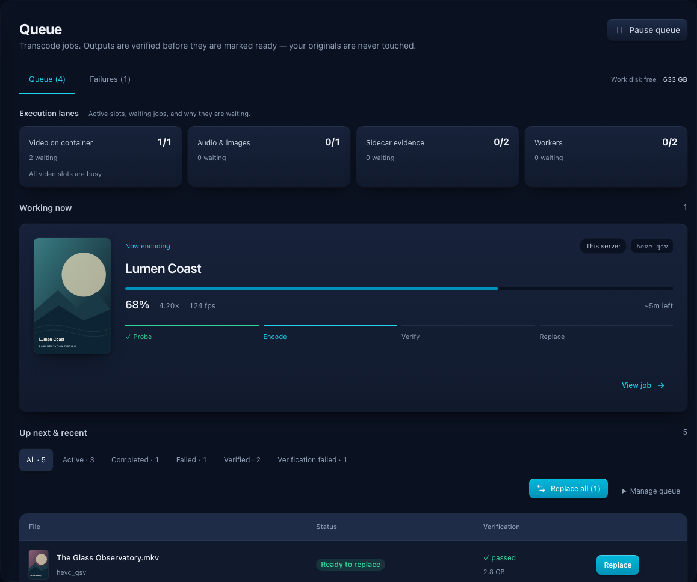
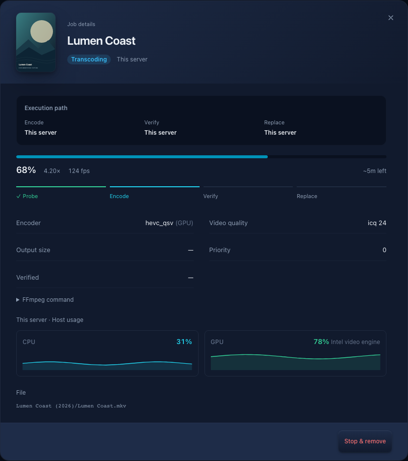
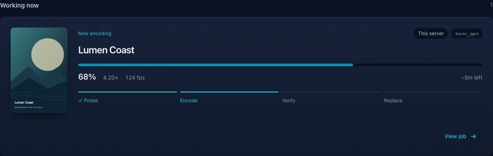
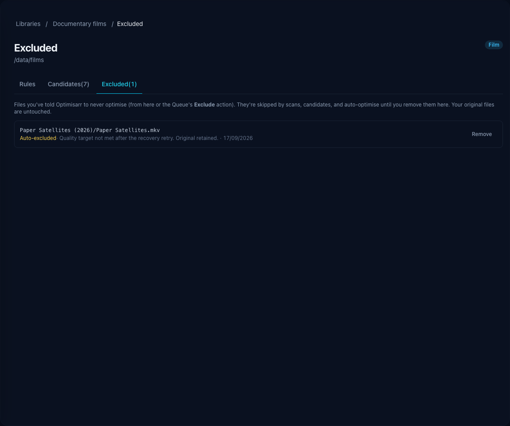
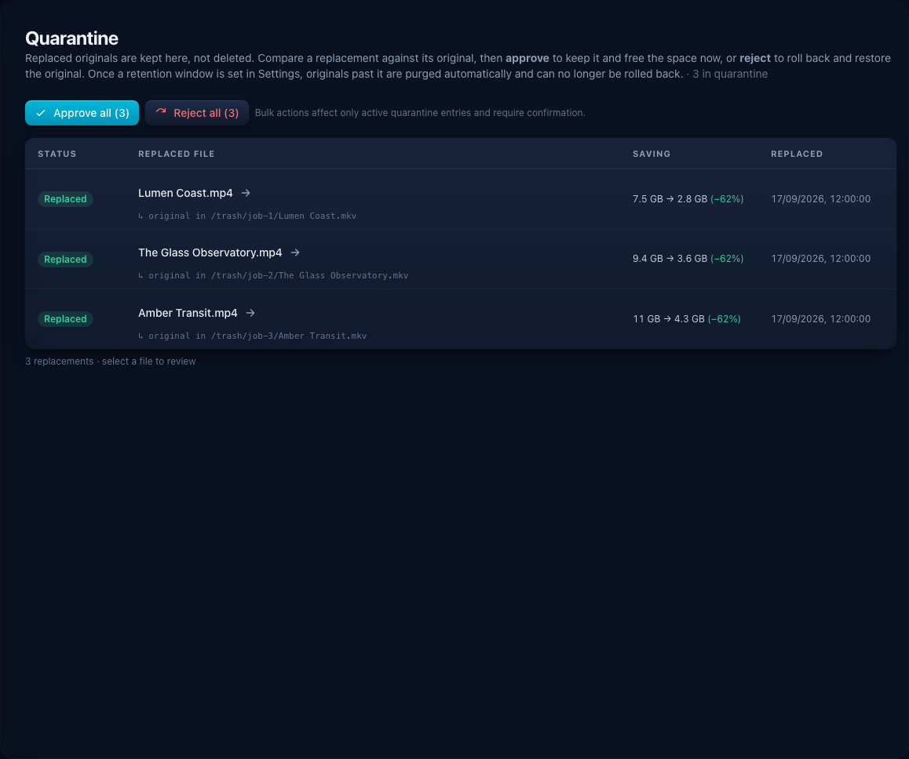

# User workflow

This walkthrough takes one small library from first scan to safe replacement.
Do this once manually before enabling automation.

```text
Dashboard -> Libraries -> Inventory -> Preview -> Queue -> Quarantine -> Automation
```

Keep **Dry-run mode** on for the first pass. Dry-run lets Optimisarr scan,
transcode, and verify, but it refuses actions that would move or purge originals.

Screenshots in this guide use fabricated dummy media created for documentation.
No copyrighted material is used.

## 1. Check the Dashboard

Start here after deployment or an update.



Do this:

1. Open Optimisarr.
2. Confirm **All systems healthy**.
3. Check the Queue, Ready to replace, and Libraries cards.

You should see a green health state before queueing work. If the health card is
not green, open **Settings → System → Tools** or run:

```bash
curl http://localhost:8787/api/ready
```

## 2. Add or review a library

A library is a folder plus rules. Start with one small Film, TV, Music, Photo,
or Other library.


Do this:

1. Go to **Libraries**.
2. Add a library or click **Configure** on an existing one.
3. In **Choose files**, use a path as the container sees it, usually below `/data`, and pick the
   media type, eligibility rules, and priority.
4. In **Encode**, choose the processing mode and preset or format. Open **Video settings**,
   **Audio & subtitles**, or image settings when you need those controls.
5. For video re-encodes, review **Video quality path**: new libraries start with Adaptive per-title
   VMAF and the Visually lossless target. Fixed quality can use a named VMAF tier or turn VMAF off.
6. In **Verify**, review the required safety checks. **Advanced verification** contains precise
   tolerances and custom perceptual-quality floors and sampling.
7. In **Schedule & replace**, choose automation, its time window, and the output destination.
8. Use the overview or breadcrumbs to move between stages. The draft is retained, and **Save**
   applies changes from all stages together. Advanced pages are optional refinements.

The library overview groups controls by processing stage. Each stage opens its own page, and
breadcrumbs return to the overview without discarding your draft.



Preset guide:

| Goal | Preset |
|---|---|
| Maximum playback compatibility for 8-bit sources | Compatibility H.264 |
| General space saving | Balanced / Conservative HEVC |
| Smallest files and slower encodes | Efficiency AV1 |
| Scott's compatibility-first setup | Scott's Settings |
| No re-encode, container cleanup only | Remux / cleanup |

Under **Encode → Video settings → Advanced encoding**, **Encoder effort** is portable across encoder modes:

| Choice | Behaviour |
|---|---|
| Encoder default | Let the selected encoder or driver choose |
| Fast | Prefer shorter encoding time |
| Balanced | Use a middle speed/compression trade-off |
| Efficient | Spend more encoding time improving compression |

Optimisarr resolves that choice only after selecting the actual encoder for the file. It therefore
uses valid x264/x265, SVT-AV1, NVIDIA NVENC, or Intel QSV syntax even in **Auto** mode; VAAPI uses its
driver default because it has no consistent cross-codec preset.

Compatibility H.264 is limited to proven 8-bit sources. A source above 8-bit is skipped with guidance
to choose Balanced HEVC or Efficiency AV1, which preserves its bit depth without silently changing
the selected preset. A source whose bit depth cannot be confirmed is skipped until it is re-probed.

VMAF policy guide:

| Goal | Library policy |
|---|---|
| Skip perceptual scoring for this library | Off |
| Prefer smaller outputs | Space-saver or Balanced |
| Protect high-value media more strictly | High, Visually lossless, or Archival |
| Tune exact floors and sampling cost | Custom |

The custom floors must remain ordered: catastrophic frame ≤ fifth percentile ≤ harmonic mean.
Scoring every frame and the full file is the strongest check; three representative samples and
every-Nth-frame scoring trade some coverage for faster verification.

For a more personal starting point, save the library and select **Personal quality check** beside its
optimisation preset. Film, TV, Music, Photo, and mixed libraries can run a blind comparison suited to
their media. Settings and estimated savings stay hidden until you finish, and applying a result only
changes that library's saved quality value; it does not queue or replace media. Follow [Choose a
personal quality setting](personal-quality-check.md) for prerequisites, screenshots, media-specific
controls, HDR limits, result interpretation, and troubleshooting.

You should see **access ok** on the library card. If not, fix the host mount,
`PUID`/`PGID`, or folder permissions before queueing jobs.

## 3. Scan the library

Scanning finds media files. Background probing reads stream details with
`ffprobe` so Optimisarr can explain what it will do.

Do this:

1. Click **Scan** on the library.
2. Wait for the discovered file count to update.
3. Open **Configure → Candidates** to see how the current rules classify files.



You should see each file marked **Eligible** or **Skipped** with a reason. A
skipped file is not an error; it often means the file is already in the target
codec, too small, excluded, outside a resolution limit, or cannot save space.

## 4. Inspect Inventory

Inventory is the safest place to understand your library before encoding.



Do this:

1. Go to **Inventory**.
2. Filter to your test library.
3. Click **Eligible** to see what would be queued.
4. Click **Skipped** to sanity-check why files are being ignored.
5. Open a row to inspect details before queueing.



You should understand why a file is or is not eligible before you queue it. If
the decision is surprising, change the library rules first and scan again.

## 5. Preview one representative file

Preview is a throwaway test encode. Use it before queueing many files.

Do this:

1. Open an eligible Inventory row.
2. Click **Preview**.
3. Compare original and encoded stats.
4. Read the verification report.

Long video previews encode a 60-second sample from the middle of the source and
mark the report as segment-only. The original player opens at that exact source
window while the encoded player opens at zero; **Play both** and either player's
native play, pause, seek, or playback-rate control keep the two source-relative
positions synchronized. You can use each native fullscreen control or download
either exact file for closer inspection. The midpoint follows the freshly measured
primary-picture duration rather than subtitle or attachment timing. A bounded
coarse seek plus exact trim keeps copied audio/subtitles on the same clock as the
re-encoded picture. Audio and image previews run in full.
A preview does not prove every file will pass, but it quickly catches bad
presets, audio choices, HDR handling, or quality thresholds.

## 6. Queue a small batch

Queue only a small test set until you trust the preset.



Do this:

1. Go back to **Libraries**.
2. Click **Enqueue** on the test library.
3. Open **Queue**.
4. Watch the status banner, filters, and job rows.

The Queue tells you why work is running or waiting. Common waiting reasons are a
closed auto-optimise window, an activity watcher pause, concurrency limits, or
low free space in `/work`.

For adaptive per-title quality with a required size saving, Optimisarr forecasts
the finished file's size from the quality samples before starting the full encode.
Each 40-second sample is compared with the bytes the source itself spent on the
same scenes, so a busy or quiet sampled scene does not skew the result. That
ratio is applied to the source's picture, with copied audio and subtitles counted
unchanged and re-encoded audio estimated from its target bitrate.

If the chosen quality's samples forecast a file larger than the library allows,
the job moves to **Needs review** instead of spending a full encode. A sample
that misses the VMAF target and still does not fit also stops the search at once,
because any quality that passes would be larger. Open the job to read the
estimate and how each sampled scene compared. **Encode anyway** repeats the
quality search on the assigned encoder and permits one full encode; the final
size and quality checks still apply. **Stop and remove** clears the held job.
The forecast is an estimate from three scenes, so the rest of the video can
differ. No original file changes while a job waits for review. Searches on Mac
and Windows sidecars are forecast the same way.

Use **Pause queue** at the top right of the Queue page when you need Optimisarr to yield the server
for maintenance or other work. It stops new jobs and automatic replacements from starting. On the
Linux container and on macOS, running transcodes are suspended in place without losing progress;
on an unsupported platform, they finish and the banner says that the pause is dispatch-only.
Verification already underway also finishes, and an automatic replacement already in its protected
quarantine sequence finishes before the pause is acknowledged. Once the paused banner appears, no
new automatic replacement can begin. The pause survives a restart until you select **Resume queue**.

The banner reports partial signal failures instead of claiming every encode stopped. If Resume
cannot continue an active FFmpeg process, dispatch stays paused; select **Resume queue** again after
checking the container log.

During a container update, Optimisarr temporarily continues suspended transcodes so the normal
graceful drain can complete; it does not clear the saved pause. The restarted container therefore
stays paused until you explicitly resume it.

Open any job row to see its media details in a centred dialog, including while work is running.
The dialog opens in the visible viewport even when the queue is scrolled, and closing it returns
you to the same queue position.

Failed outputs remain under `/work` long enough to inspect. **Settings → Files & safety →
Replacement and cleanup → Cleanup retention** controls when the timed sweep removes
their scratch files; the failure report and FFmpeg log remain in Optimisarr. The
same panel shows the space currently eligible for cleanup. Use **Clean up now** to
run the saved policy immediately after reviewing the failed-work/quarantine
breakdown and permanent-deletion confirmation.



The working-job card keeps progress, the assigned encoder, and **View job** together.



Use the row actions carefully:

- **Retry** after changing the cause of a failure.
- **Exclude** when you do not want that file offered again.
- **Remove** clears a queue entry when it is safe to clear.
- **Replace** appears only after verification passes and dry-run is off.
- **Replace all** uses one confirmation for every verified, ready output. Each original still moves to
  Quarantine independently; if any item cannot be replaced, Queue remains open so you can review it.

## 7. Review exclusions

Exclusions stop repeat failures from wasting time.



Files can be excluded manually from Queue, or automatically when another encode cannot safely recover:

- a VMAF-only failure gets one higher-quality retry, then excludes if it still fails;
- a size-saving failure excludes immediately rather than lowering the configured quality;
- a combined size and VMAF failure excludes immediately because improving one would worsen the other;
- other terminal failures exclude after three attempts, while cancellations and worker interruptions
  do not count.

The original is untouched, the recorded reason remains visible here, and every automatic exclusion is
reversible. Remove one only when you want the file to become eligible again.

## 8. Replace and review Quarantine

Replacement is the only point where the library path changes.



What happens during replacement:

1. The original moves to `/trash`.
2. The verified output moves into the library path.
3. Optimisarr records rollback metadata.
4. Connected media servers are asked to refresh.

In **Quarantine**:

- **Approve** keeps the replacement and permanently removes the quarantined
  original.
- **Reject** rolls back by restoring the original and removing the replacement.
- Retention can purge older originals automatically.

Quarantine is a rollback buffer, not a backup. Keep independent backups for
media and `/config/optimisarr.db`.

## 9. Enable automation last

Once a manual batch looks good, enable automation per library.

Use **Optimise automatically** when you want eligible files queued and started
inside a local-time window. Use `00:00` to `00:00` for all day.

Use **Auto-replace** only after you have reviewed successful jobs for that
library and preset. Auto-replace still verifies outputs and quarantines originals
first, but it removes the manual click between verification and replacement.

Keep dry-run on while testing automation if you want evidence without original
file changes.
