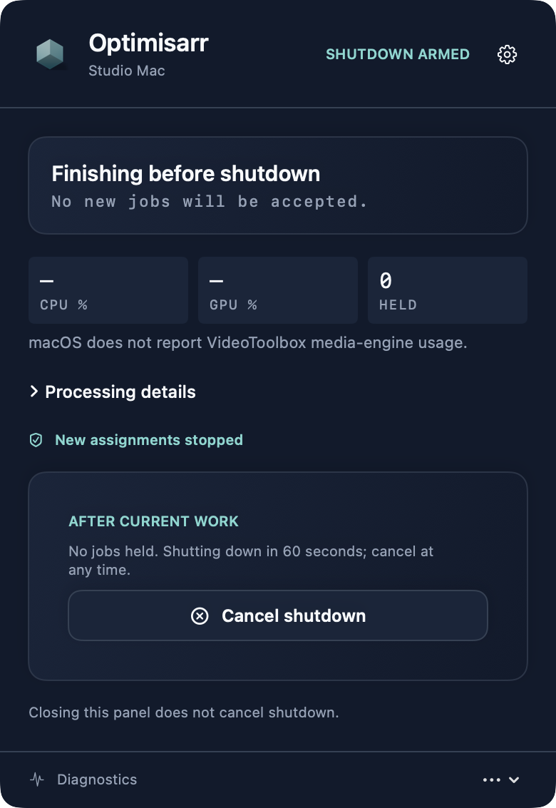
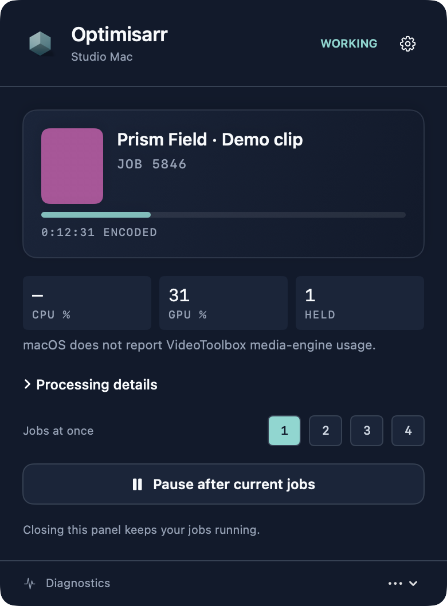
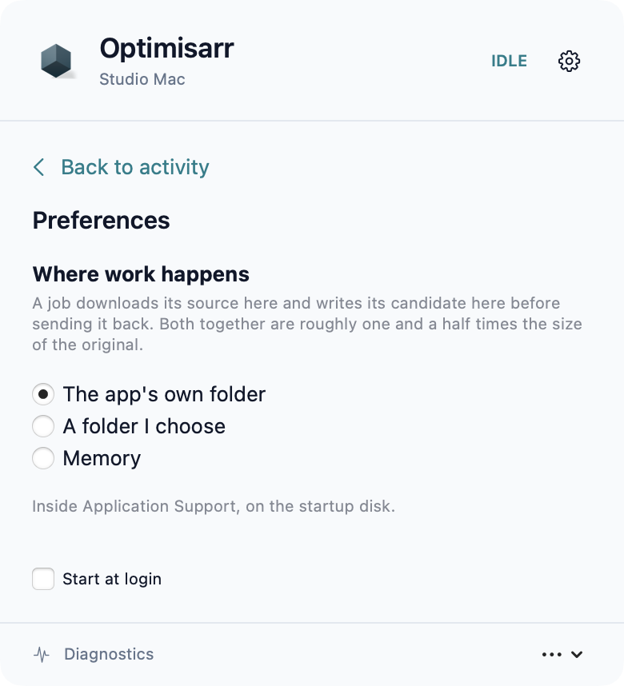

# Optimisarr macOS sidecar

A menu-bar app that pairs a Mac with an Optimisarr server so it can contribute spare encoding
capacity. It uses the same Precession application icon and Compact Monitor layout as the
[Windows tray companion](../windows/README.md).

## What this version does, and does not

It pairs, stores its credential, reports what this Mac can actually do, checks in, and — once the
server has confirmed it is eligible under the configured policy — asks for work. A job runs like this:

1. **Claim.** On each healthy check-in while idle, the app asks for one job. The server answers
   with the exact FFmpeg command it would have run itself, resolved for an encoder this Mac
   proved, with two tokens standing in for paths.
2. **Validate.** The command is checked before a byte is fetched: every option is one the server's
   builder is known to emit, the only input is the `{{input}}` token, the only output is the
   `{{output}}` token in last position carrying the promised extension, and no other value looks
   like a path. Anything else is refused whole and the job handed back with the offending token
   named. The server decides *what* to encode; it never names files on this machine.
3. **Fetch and prove.** The source is downloaded by lease into the app's own scratch in 64 MB byte
   ranges. A dropped connection resumes from the last complete range rather than restarting a
   multi-gigabyte file. Every range is checked against the server's response and the assembled
   source is hashed; a transfer that does not match the server's hash is never encoded. Immediately
   before the first byte, the sidecar also rechecks that its real work volume can still hold the
   source plus the candidate allowance and hands the lease back if it cannot.
4. **Encode, renewing.** The bundled ffmpeg runs the command against this Mac's paths. The lease
   is renewed throughout; losing it stops the encode rather than finishing work the server has
   already given to someone else.
5. **Measure and verify.** Quality-gated assignments carry validated libvmaf commands. The Mac
   returns raw measurement logs bound to source and candidate hashes; the server parses and judges
   the scores. With **Verify entirely on the sidecar** enabled, the assignment also requests source
   and candidate probes, a complete candidate decode, timestamp checks and, when needed, audio
   loudness measurements. Missing or invalid evidence fails that strict assignment; it does not
   trigger server-side verification. With strict verification disabled, the server retains its
   normal verification and measurement fallback.
6. **Deliver.** The candidate is hashed and uploaded with both hashes in resumable 64 MB chunks
   (or one request for an older server). The server validates the evidence against the received
   bytes, applies its safety rules and owns replacement and quarantine. Nothing is replaced from
   this Mac, ever.

### Where jobs and verification run

Enable workers under **Settings → Files & safety → Remote workers**. In the same section,
**Verify entirely on the sidecar** defaults on for new installations and requires complete verification evidence for new worker
assignments. Pair and inspect machines under **Settings → Remote workers**. If these controls are absent,
the server operator must opt into the preview with `OPTIMISARR_EXPERIMENTAL_REMOTE_WORKERS=true`
in the container environment and restart through their normal deployment process.

Choose placement separately for each library under **Libraries → open a library → Choose files →
Advanced eligibility → Where this library's work may run**. Select **Only on workers** to keep
eligible video re-encodes off the server, and enable strict verification to keep their media
verification there too. Worker placement applies to video re-encodes; remuxes, audio-only and image
jobs remain server work. The server still schedules jobs, transfers and hashes files, evaluates
evidence, writes its database and performs replacement/quarantine. This is not a zero-work server
mode. Keep remote workers enabled: placement preferences are ignored while they are disabled.

If a library requires a smaller output, its full-encode assignment includes a frozen byte limit.
The library can optionally require a minimum useful saving (for example, 10%); this tightens the
same limit for both server and worker encodes. A blank target accepts any reduction.
The Mac stops when the candidate exceeds that limit and reports a terminal **Size saving** failure
instead of handing the same job to another worker. The source is retained.
An optional maximum allowed saving sets a frozen final-size floor (65% requires at least 35% of
the source size). Updated Mac sidecars reject a smaller finished candidate before final full-file VMAF verification or upload
with a terminal **Compression ceiling** result; blank leaves compression unrestricted.

Scratch lives under `~/Library/Application Support/OptimisarrSidecar/work` and is removed on every
exit path. **Jobs at once** in the menu chooses how many jobs run in parallel (one to four); the
number is reported on every check-in and the server holds the worker to it. The machine is probed
again on every launch, not only at pairing, so a relaunched app reports what it can do today.

While a job runs the app holds a system activity assertion, so macOS neither naps it nor idles the
machine to sleep under an encode. When the Mac does sleep — a closed lid, a chosen sleep — the job
is handed back to the server first, so it is reassigned at once rather than after the lease lapses,
and check-ins resume the moment the Mac wakes. Quitting the app mid-job hands the job back the same
way before the app exits. **Start at login** in the menu registers the app as a login item through
the system's own service, so it also appears under System Settings › General › Login Items; it needs
the app to run from the built bundle rather than a bare build directory.

**Shut down when work is complete** in the menu immediately stops new claims and reports zero worker
capacity. Current jobs continue through verification, upload and server acknowledgement. Once no
lease or transfer is held and the server has confirmed the drain, the menu shows a 60-second
countdown with **Cancel shutdown**. A disconnect or unconfirmed hand-back blocks the countdown;
closing the menu does not cancel it. Cancel restores the previous pause setting. The request is
in-memory only, so restarting the app does not unexpectedly shut down the Mac. macOS may ask for
System Events automation permission; a denial is shown in the menu and is never retried silently.



This loop has run end to end on real hardware: `LiveWorkLoopTests` pairs with a running server,
claims a queued job, encodes it with the bundled ffmpeg and delivers it, and the server's own
verification policy — including the configured VMAF gate — then judges the candidate. Run it
against a server that has a job queued this Mac can take:

```bash
OPTIMISARR_LIVE_URL=localhost:8787 OPTIMISARR_LIVE_PIN="1234 5678" \
OPTIMISARR_FFMPEG=$(pwd)/vendor/ffmpeg swift test --filter LiveWorkLoop
```

What it reports is real. It bundles its own ffmpeg, built from pinned source by
[`scripts/build-ffmpeg.sh`](scripts/build-ffmpeg.sh), and probes this machine in two stages: parse
`ffmpeg -encoders`, then confirm each VideoToolbox encoder with a real throwaway encode. Every Apple
build lists VideoToolbox whether or not a given machine can open it, so listing alone would have the
sidecar advertise encoders that fail on first use. Hardware *decode* is proved the same way — encode
a clip, decode it back with VideoToolbox engaged, and both halves must succeed.

When the server has seen that proof, the command it sends decodes with VideoToolbox for a
VideoToolbox encode, with the frames left in system memory so its filters still apply; the
validator accepts `-hwaccel videotoolbox` and nothing else under that option. If a candidate decoded
that way comes back with the signature of decoder corruption, the server requeues the job to decode
in software and says so on this worker's card.

A machine that proves nothing reports nothing, and Optimisarr's capability matcher fails closed, so
such a worker is never offered work. Honesty here is the safety mechanism: a sidecar that overstated
itself would have jobs scheduled onto it that could only fail.

Optimisarr remains the only thing that replaces or quarantines an original library file. A sidecar
never has direct access to the original library. It reads and writes only its downloaded source,
candidate and temporary work files.

## The Compact Monitor

Screenshots use fabricated dummy media created for documentation, invented machine names and
example server addresses. No copyrighted media material is used.





[Compare native activity, Processing details and Preferences on both platforms](../../docs/design/windows-sidecar/native.html).

Click the Precession icon in the menu bar for the compact activity panel. It shows the Mac's name,
connection state, current jobs or **Ready for work**, and CPU/GPU/held-job readings. Unknown values
stay unavailable; macOS does not expose VideoToolbox media-engine utilisation, so the GPU reading
must not be interpreted as encoder utilisation.

**Processing details** expands the technical readout and previews. The gear opens **Preferences**
inside the same panel; **Diagnostics** opens connection and capability details with a route back to
activity. The native popover stays anchored to the menu-bar item when its content changes size,
keeps its rounded corners, and cannot be detached into a floating window.

**Jobs at once** selects one to four concurrent jobs. **Pause new jobs** (or **Pause after current
jobs** while working) lets current leases finish; it does not cancel them. Closing the panel leaves
work running. Quitting the application hands current leases back to the server.

Both light and dark appearances use the application's slate surfaces, accent colours and card
shadows. The menu-bar, application and panel icons use the shared Precession artwork. The native
status mark is static; activity is communicated through the labelled state and job progress,
with an amber badge when the Mac is disconnected.

## Codecs

Encoding, all proved with a real test encode at launch rather than taken from FFmpeg's listing:

| Target | On this Mac |
| --- | --- |
| H.264 | `h264_videotoolbox` (hardware) and `libx264` |
| HEVC | `hevc_videotoolbox` (hardware) and `libx265` |
| AV1 | `libsvtav1` (software only) |
| Audio | `aac`. **Not** `libopus` or `libmp3lame` — the build links no external audio libraries, so a library set to Opus or MP3 is never offered to this worker |

**This sidecar currently offers software AV1 encoding through SVT-AV1.** Hardware decoding is
advertised only where the launch probe succeeds. The bundled build is pinned to FFmpeg 8.0.3; see
`vendor/BUILD-INFO.txt` after building for the exact source revisions.

Decoding covers H.264, HEVC, VP9, AV1, MPEG-2, VC-1 and ProRes, with VideoToolbox acceleration
where the server asks for it.

## Options

The **Preferences** gear opens work-location and login settings inside the Compact Monitor.
Choose **Back to activity** to return to job progress.

**Where work happens.** A job downloads its source and writes its candidate before sending it back,
which together come to roughly one and a half times the size of the original. Three choices:

- *The app's own folder*, inside Application Support on the startup disk. The default.
- *A folder I choose* — an external SSD, or simply somewhere off the startup disk. If the drive is
  not mounted at launch this falls back to the default rather than failing every job on a path that
  no longer exists.
- *Memory*, a RAM disk created for each job and destroyed when it ends.

**About memory.** A job needing more working space than the budget runs on disk instead. It is
never refused over this setting — losing work to a preference would be worse than ignoring the
preference, and a refused job goes straight back on the queue to be offered again. The budget
defaults to a quarter of installed memory and is adjustable between a twentieth and a half; a RAM
disk holds real pages for as long as the job runs, and filling most of a Mac's memory with one
leaves it swapping, which is slower than the SSD the setting was meant to avoid.

It is also rarely faster. A download is limited by the network and an encode by the encoder, not by
an Apple SSD. Most films will not fit any sensible budget.

Stray volumes from a crash are swept at launch, since one left behind holds memory until the Mac
reboots with nothing on screen to say so.

## Requirements

- macOS 14 or later
- Xcode 26 (or a Swift 6 toolchain) to build
- An Optimisarr server with **Settings → Files & safety → Remote workers** switched on

## Build and run

```bash
cd sidecars/macos
./scripts/build-ffmpeg.sh       # first build; requires the build tools documented in the script
./scripts/make-app.sh release  # version defaults to Directory.Build.props
open build/OptimisarrSidecar.app
```

It appears in the menu bar with no Dock icon. Click it, enter your server address and the pairing
code from **Settings → Remote workers** in Optimisarr, and press Pair.

The server address is whatever you use to reach Optimisarr in a browser — `optimisarr.local:8787`,
an IP and port, or a full `https://` URL behind a reverse proxy. A missing scheme is assumed to be
`http://`, since this is usually a LAN tool.

## If no icon appears

The app has no window and no Dock icon, so a menu bar with no room left for it looks identical to
an app that failed to launch.

macOS fills the menu bar right-to-left, and on a Mac with a notch the items that run out of room go
behind it rather than being pushed off the edge. A newly launched app is last in the queue, so it is
the first to disappear.

This was hit on the first real launch. Measuring the screen with `NSScreen` rather than guessing:

| Region | Range |
| --- | --- |
| Usable left of notch (`auxiliaryTopLeftArea`) | x 0 – 646 |
| **Notch** | **x 646 – 825** |
| Usable right of notch (`auxiliaryTopRightArea`) | x 825 – 1470 |
| This app's status item | **x 735 – 769** |

Entirely inside the notch, with nine other status items to its right. Note that the empty space to
the *left* of the notch is not available: macOS reserves it for the application menu and never
places status items there, so a menu bar that looks half empty can still have no room.

**While unpaired**, reopening the app can show its pairing window, which also opens on first
launch. A paired app deliberately does not open a separate window when relaunched. If its menu-bar
icon is hidden behind the notch, make room for the icon as described below.

Check whether it is actually running before assuming it crashed:

```bash
pgrep -lf OptimisarrSidecar
```

If it is running but invisible, make room: ⌘-drag any visible status icon leftward past the notch,
which reorders the row and pushes this one out the far side, or quit a menu bar app to free the
width. Once visible it can be ⌘-dragged wherever suits.

## Tests

```bash
swift test
swift build --configuration release
```

The suite covers the protocol client, resumable transfers, scratch-space refusal, lease loss during
transfers, the pairing and check-in lifecycle, address handling, and capability probing — including
live probes against the bundled ffmpeg. Native AppKit tests also expand and collapse real popover
content and verify that its top edge stays anchored. CI runs the ordinary suite and release build
on an Apple Silicon macOS runner; the live suites remain explicit acceptance tests because they need the pinned
FFmpeg and, for the work loop, a paired server with a suitable queued job.

There is also a live suite that runs against a real server, skipped unless you point it at one:

```bash
OPTIMISARR_LIVE_URL=localhost:8787 OPTIMISARR_LIVE_PIN="1234 5678" swift test
```

Worth running when the contract changes. The stubbed tests prove this client behaves the way its
author believes the contract works; only a live run proves the belief itself.

## Where the credential lives

In the login Keychain, under `uk.optimisarr.sidecar` — never in `UserDefaults`, a plist, or a log.
It is issued once at pairing and cannot be reissued by the server, so it is written to the Keychain
before anything else can go wrong.

"Forget this pairing" clears it locally. That does **not** revoke it server-side; only an operator
can do that, from Settings → Remote workers in Optimisarr. If a worker is revoked there, this app notices on
its next check-in, discards the dead credential, and says so.

An item written by an earlier build whose signature this one no longer matches cannot be read —
an ad-hoc build's signature changes every time it is rebuilt, so to the Keychain it is a different
application each time. The app detects that without letting a dialog appear, removes the item, and
reports itself unpaired so you pair once more rather than being asked for a password for ever.
Builds signed with the same Developer ID certificate read each other's items, so an upgrade keeps
its pairing.

## Pairing without a screen

```
/Applications/OptimisarrSidecar.app/Contents/MacOS/OptimisarrSidecar \
  --pair https://optimisarr.example.com
# Type the pairing code on standard input, then press Enter.
```

Pairs and exits, printing the worker id on success and the reason on failure. Nothing appears on
screen, so a Mac can be paired over SSH, scripted onto several machines at once, or recovered
remotely when a pairing is lost.

The PIN is read from standard input rather than taken as an argument, so it never lands in `ps`
output or a shell history. Get one from Settings → Remote workers, or from
`POST /api/workers/pairing-code`.

Give the address with its scheme. A bare host is reached over `http://`, which is right for a
server on a home network and wrong for one behind a TLS proxy; the failure message says so when the
address had no scheme.

## Signing and release

`make-app.sh` applies an ad-hoc signature by default, which is enough to run locally. Set
`SIGNING_IDENTITY` to sign with a real certificate:

```bash
security find-identity -v -p codesigning          # what this Mac holds
SIGNING_IDENTITY="Developer ID Application: You (TEAMID)" ./scripts/make-app.sh release
```

A real certificate is worth using even for local work. An ad-hoc signature is derived from the
binary, so it changes on **every build**, and the Keychain — which decides access by signature —
sees each rebuilt copy as a different application. The pairing then cannot be read, and on the
legacy keychain macOS asks for a password to reach it, over and over. With a certificate the
signature is stable and a pairing survives rebuilds.

### What you need once

1. **A Developer ID Application certificate.** In Xcode: Settings → Accounts → your Apple ID →
   Manage Certificates → **+** → *Developer ID Application*. Only the Account Holder of the team
   can create one. An *Apple Development* certificate is not a substitute: it signs and runs
   locally, but Apple will not notarise anything signed with it.
2. **An App Store Connect API key** for notarisation, from
   [App Store Connect → Users and Access → Integrations → App Store Connect API](https://appstoreconnect.apple.com/access/integrations/api),
   with the **Developer** role. Download the `.p8` once — it cannot be downloaded again — and note
   the Key ID and the Issuer ID. Then store it under a name the release script can use:

   ```bash
   xcrun notarytool store-credentials optimisarr-notary \
     --key ~/private_keys/AuthKey_XXXXXXXX.p8 --key-id XXXXXXXX --issuer <issuer-uuid>
   ```

### Cutting a release

```bash
SIGNING_IDENTITY="Developer ID Application: You (TEAMID)" \
NOTARY_PROFILE=optimisarr-notary \
./scripts/release-app.sh 0.2.13
```

The public release script requires a clean committed worktree so its archived source matches the
binary. It prepares or validates exact corresponding sources against the release version, current
commit and bundled media-tool revisions before signing. `SIDECAR_SOURCE_PACKAGE` can select an
existing package; a stale package fails rather than being reused silently.

It builds, signs with the hardened runtime and a secure timestamp (signing the bundled `ffmpeg`
and `ffprobe` first, as notarisation requires), archives with `ditto`, submits to Apple, waits,
staples the ticket to the bundle, re-archives, and checks the result the way Gatekeeper will. It
then builds a disk image from the stapled app and notarises and staples that too. Before notarisation,
`verify-app.sh` copies the signed app to a temporary directory and renders all twenty light/dark
fixture states using embedded artwork, without pairing or contacting a server. Final `.sha256`
files are generated after stapling. Attach the `.dmg`, `.zip`, checksums and corresponding-source
parts to the GitHub Release.

The disk image is the one to point people at: it opens with the app beside a shortcut to
Applications, so it installs by dragging. Install [`dmgbuild`](https://pypi.org/project/dmgbuild/)
for that layout — `pip install dmgbuild`. Without it the image is still built and still works, but
with Finder's default arrangement. Scripting Finder to do the layout was tried and abandoned: it
times out under automation, so the result would be a coin toss.

The app's icon is generated from `Resources/AppIcon.png`, the same mark the web app uses. The
1024px master comes from `web/scripts/render-sidecar-icons.ts`, using the main application’s
Precession renderer. The same generation step produces the Windows multi-resolution icon.
The working menu-bar frames are generated by running
`node --experimental-strip-types scripts/render-sidecar-motion.ts` from `web/`. That script writes
both themes' 48px frame atlases into both native clients from the same renderer and motion path.
The menu bar uses the packaged static master at rest and a brief transition back to it when work ends.
For a native-size visual check without connecting to a worker, run the executable with
`--render-menu-icon-motion <directory>`; it exports six working and six settling frames per theme.

Stapling matters: without the ticket attached, anyone who downloads the app on a machine that
cannot reach Apple is told it "cannot be checked for malicious software".

Use the intended release version in place of the example above, and follow the repository
[release checklist](../../docs/development/releasing.md) for the reviewed source and release notes.
A reviewed `vX.Y.Z` tag triggers container CI and both native package workflows. The Mac workflow
attaches notarised DMG/ZIP artifacts to the matching draft release. Publish only after the exact
container and native package checks pass and the matching media-tool sources are available.
Legacy `sidecar-v*` tags still trigger standalone Mac packaging. Manual dispatch must select an
existing tag whose version matches `Directory.Build.props`; it cannot publish from a branch.

See
[`.github/workflows/sidecar-release.yml`](../../.github/workflows/sidecar-release.yml), which needs
these repository secrets:

| Secret | What it is |
| --- | --- |
| `SIDECAR_CERTIFICATE_P12` | The Developer ID certificate and key, exported from Keychain Access as `.p12`, base64 encoded |
| `SIDECAR_CERTIFICATE_PASSWORD` | The password set on that export |
| `SIDECAR_NOTARY_KEY_P8` | The App Store Connect `.p8`, base64 encoded |
| `SIDECAR_NOTARY_KEY_ID` | Its Key ID |
| `SIDECAR_NOTARY_ISSUER` | The Issuer ID |

Base64 a file for pasting with `base64 -i <file> | pbcopy`.
