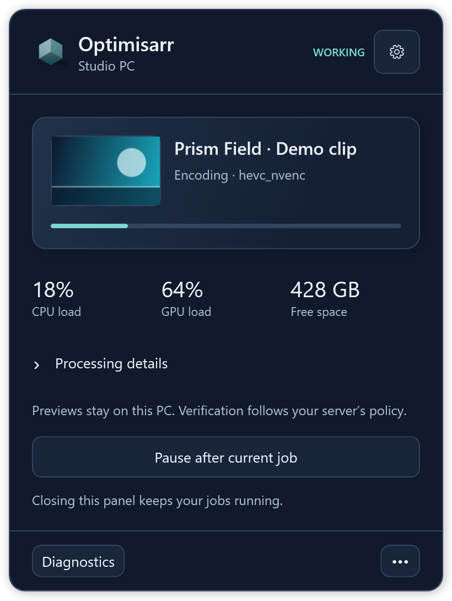
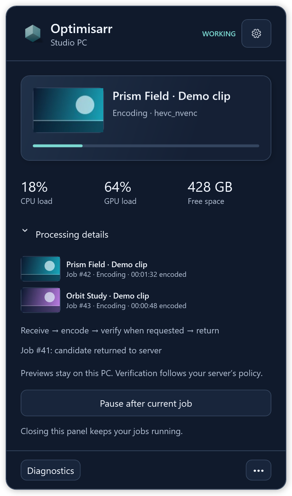
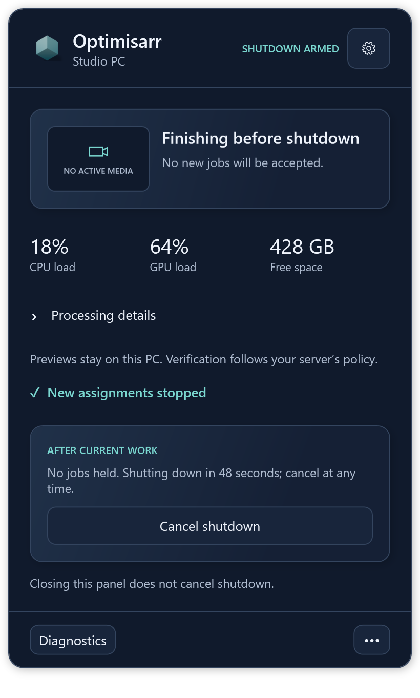
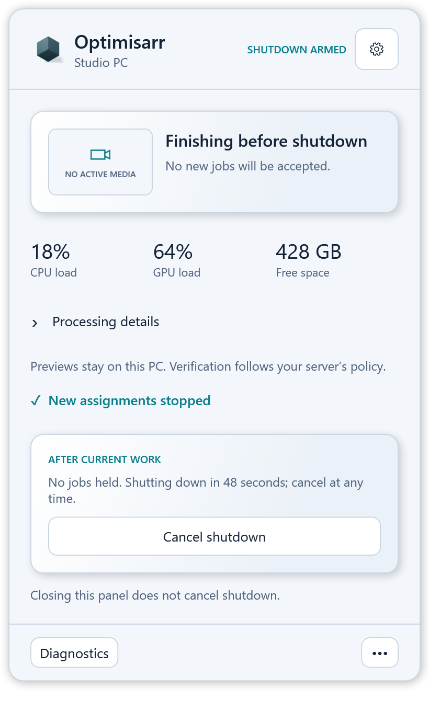
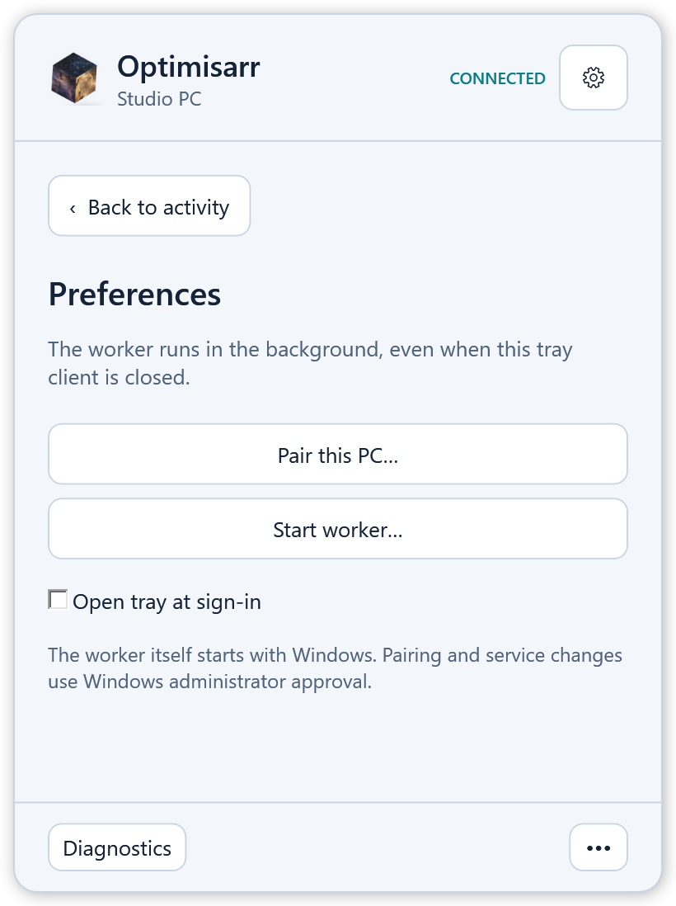

# Optimisarr Windows sidecar

A Windows machine that contributes spare encoding capacity to an Optimisarr server, the way the
[macOS sidecar](../macos/README.md) does. Same protocol, same guarantees: the server decides what to
encode, this machine encodes it and returns a candidate with any requested verification evidence.
Only the server can replace or quarantine original library files. The sidecar manages its own
downloaded source, candidate and scratch files.

## Why it is built this way

**A Windows service with a tray companion.** The macOS sidecar is a menu-bar app, so it only works while
someone is logged in. A desktop that spends the night at the login screen is exactly the machine
worth lending to a transcode queue, so the work belongs in a service that starts with the machine.

**A service cannot show a tray icon.** Session 0 has no desktop. So there are two processes: the
service does the work, and a small tray application, launched at logon, shows what it is doing and
talks to it locally. The tray is a window onto the service, never a requirement for it.

**FFmpeg is bundled.** Windows has no equivalent of "the FFmpeg everyone has", and builds vary
enormously in which encoders and which VMAF backends they carry. A pinned build is the only way a
capability probe means anything, and the only way the advertised capabilities can be relied on. The redistributable bundle uses CPU VMAF.

## Layout

```
src/Optimisarr.Sidecar.Core      Protocol, probing and execution; no Windows-only dependencies.
src/Optimisarr.Sidecar.Service   Windows service, pairing and local monitor pipe.
src/Optimisarr.Sidecar.Tray      WPF Compact Monitor and tray controls.
installer/                      MSI build, payload notices and installation tests.
tests/                          Core and local pipe tests.
```

`Optimisarr.Sidecar.Service` hosts the worker; `Optimisarr.Sidecar.Tray` provides the compact
monitor anchored to the notification-area screen. Preferences and diagnostics stay inside the panel.
The active card shows a small frame from the worker's downloaded source while the activity panel
is open; Processing details keeps each preview with its own job. Sampling is best-effort and never
changes an encode. Unsupported or audio-only media keeps a stable fallback instead.
Changing pages or expanding **Processing details** keeps the rounded panel inside that screen’s
working area. It dismisses on focus loss or Escape and is not an always-on-top window.
The tray, panel, executable and Start shortcut share the main application’s Precession icon.
When working, the tray selects pre-rendered frames of the cube's internal motion from the web
renderer; the bundled static icon remains the idle and reduced-motion frame. Regenerate both
themes' native atlases with `node --experimental-strip-types scripts/render-sidecar-motion.ts`
from `web/` after changing the main Precession geometry or lighting.
The tray is optional: closing it leaves work running. See [installer notes](installer/README.md)
for the unsigned MSI preview, pairing, upgrade safeguards and release limitations.

**Shut down when work is complete** is available from the tray menu and Compact Monitor. The
service immediately stops claiming jobs, reports zero capacity to the server, and keeps current
verification, uploads and result acknowledgement running. Only after the server confirms draining
and no job is held does a 60-second, cancelable countdown begin. A lost connection or an
unacknowledged lease blocks power-off and explains why. Closing the tray leaves the request armed;
canceling restores the previous pause setting. The request is never restored after a service
restart. If Windows denies the shutdown request, the monitor shows the error without retrying.

## The Compact Monitor

Screenshots use fabricated dummy media created for documentation, invented machine names and
example server addresses. No copyrighted media material is used.









If a frame is unavailable, the monitor keeps a labelled placeholder. Previews are sampled from
the worker's local source only while the activity panel is open; they never affect encoding or
verification.



[Compare native activity, Processing details and Preferences on both platforms](../../docs/design/windows-sidecar/native.html).

## Capabilities

Every capability is **proved before it is advertised**, never read from `ffmpeg -encoders`. A build
carrying NVENC lists it on a machine with no NVIDIA card; a driver too old for the build fails when
the encoder is first opened, not when it is listed. The macOS sidecar shipped a bundled libx265 that
segfaulted on its first frame while being offered to the server as a capability, and a job scheduled
against a capability the machine cannot honour can only fail and come back.

So each of these runs for real at service start:

| Capability | How it is proved |
| --- | --- |
| Video encoders | Three frames of synthetic video, at a size that clears NVENC's minimum |
| Audio encoders | A fifth of a second of silence |
| Hardware decoders | Encode a clip, then decode it back with the accelerator engaged |
| VMAF | Score a clip against itself: CUDA first, then CPU |

Encoders looked for are libx264, libx265, libsvtav1, and the NVENC, Quick Sync and AMF families.
Audio is narrowed to what Optimisarr can actually ask for, including `libopus` and `libmp3lame`,
because claiming one the build lacks means a job handed over and refused with "Unknown encoder".

**NVIDIA VMAF** is the one capability that cannot be inferred at all. A build can carry
`libvmaf_cuda` while the machine has no usable CUDA device, and the server sends a GPU measurement
command on the strength of this answer alone, so it is scored for real.

## Setting up a machine to test on

See [Setting up a Windows test host](docs/test-host-setup.md): remote access, tooling, the scratch
folder, and optionally WSL with Docker for testing the server image against an NVIDIA GPU.

## Installing it on a machine

Use the [MSI installer](installer/README.md) for a normal installation. It includes FFmpeg, ffprobe,
the service, the tray companion and private Microsoft .NET/Windows Desktop runtimes. No separate
runtime installation is needed. First installation leaves the worker stopped until it is paired.

1. Open **Optimisarr Sidecar** from Start and click its notification-area icon.
2. In **Preferences**, choose **Pair this PC**, enter the server address and its short-lived pairing
   code, then start the worker. Pairing and service start require administrator approval.
3. Enable **Open tray at sign-in** if wanted. The service starts with Windows independently of this
   per-user preference, and continues working when the tray is closed or nobody is signed in.

For headless pairing, run an administrator PowerShell window and read the code from standard input:

```powershell
Set-Location 'C:\Program Files\Optimisarr Sidecar'
.\runtime\dotnet.exe .\Optimisarr.Sidecar.Service.dll --pair https://optimisarr.example.com
# Type the short-lived pairing code, then press Enter.
Start-Service OptimisarrSidecar
```

The service is a managed assembly launched by the bundled Microsoft-signed `dotnet.exe`. The WPF
tray has its own apphost executable and uses the private desktop runtime. The current MSI and tray
apphost are unsigned previews; see the installer’s distribution status before sharing them. Do not
disable Smart App Control or other Windows protections to run a preview.

### Worker placement and strict verification

When a library requires a smaller output, the assignment carries a frozen candidate byte limit.
The worker stops a full encode that exceeds it and reports a terminal **Size saving** failure; it
does not hand the job to another worker to repeat the same encode. The source file is retained.
An optional minimum useful saving on the library tightens that frozen limit (10% means the output
must be at most 90% of the source); blank retains the any-reduction rule.
An optional maximum allowed saving adds a frozen final-size floor (65% requires at least 35% of
the source). Updated Windows sidecars reject a smaller finished candidate before final full-file VMAF verification or upload
with a terminal **Compression ceiling** result; blank leaves compression unrestricted.

Enable **Remote workers** under **Settings → Files & safety** on the server, then pair through
**Settings → Remote workers**. If these controls are absent, the server operator must enable
`OPTIMISARR_EXPERIMENTAL_REMOTE_WORKERS=true` in its container environment through the normal
deployment process. Each library chooses placement under **Choose files → Advanced eligibility →
Where this library's work may run**. **Only on workers** keeps eligible video re-encodes off the
container; **Prefer a worker** allows server fallback after ten minutes. Remote workers must remain
enabled for these placement choices to apply. Remuxes, audio-only and image jobs remain server work.

**Verify entirely on the sidecar** defaults on for new installations and applies to new assignments.
It asks updated sidecars for source/candidate probes, complete candidate decode, timestamp checks,
optional audio loudness measurements and any configured VMAF measurements. The server binds this
evidence to the transferred source and candidate hashes and evaluates its safety rules. Missing or
invalid evidence fails the strict job rather than causing a server-side verification fallback.

This removes media verification from the server for those worker jobs. It does not remove server
scheduling, file transfers and hashing, database work, evidence evaluation or replacement/quarantine.
With the toggle off, the server retains normal verification and measurement fallback.

### Manual developer installation

A source-only installation is still available for debugging. It requires a machine-wide .NET 10
runtime and a matching FFmpeg/ffprobe bundle next to the service. From `sidecars/windows`:

```powershell
dotnet publish src\Optimisarr.Sidecar.Service\Optimisarr.Sidecar.Service.csproj -c Release -o C:\OptimisarrSidecar
dotnet C:\OptimisarrSidecar\Optimisarr.Sidecar.Service.dll --pair https://optimisarr.example.com
# Type the pairing code and press Enter, then register the service:
dotnet C:\OptimisarrSidecar\Optimisarr.Sidecar.Service.dll --install
Start-Service OptimisarrSidecar
```

Do not register this over an MSI-owned service. Conversely, the MSI refuses a manually registered
service until it is explicitly drained and its old registration removed. Pairing is retained in
`%ProgramData%\Optimisarr\Sidecar`; do not delete it during migration.

## Building and testing

```bash
cd sidecars/windows
dotnet test tests/Optimisarr.Sidecar.Core.Tests
```

The core targets `net10.0` and has no Windows-only dependencies, so this works on macOS and Linux
too. Build the complete WPF/service solution on Windows with:

```powershell
dotnet build Optimisarr.Sidecar.slnx -c Release -warnaserror
.\src\Optimisarr.Sidecar.Tray\bin\Release\net10.0-windows\Optimisarr.Sidecar.Tray.exe --verify-popover
```

The native check opens the actual monitor, changes pages and disclosure state, and checks its
working-area anchor. `--render-monitor <directory>` writes isolated fixture images without polling
a live worker, including preview, fallback and two-job states. Set
`OPTIMISARR_PREVIEW_FFMPEG` to an installed `ffmpeg.exe` before running the focused native preview
test to exercise extraction from a synthetic video and audio-only fallback.
[Installer validation](installer/README.md#validation) additionally exercises the
installed binaries and private runtime. Real GPU and end-to-end media checks use the
[media acceptance harness](../../docs/development/media-acceptance.md).

## Releases

Follow the repository [release checklist](../../docs/development/releasing.md). The
[Windows installer workflow](../../.github/workflows/windows-installer.yml) currently builds and
tests unsigned preview artifacts on relevant pull requests, manual dispatch and reviewed `vX.Y.Z`
tags. For a tag, the tested MSI and checksum are attached to the matching draft release alongside
the Mac packages. Publish only after all exact-tag checks pass and matching media-tool sources are
available. The Windows download remains explicitly an unsigned preview.

The MSI version defaults to `Directory.Build.props`; `installer/build.ps1 -Version <version>`
overrides it for an explicit build. Tag publication requires the tag and shared version to agree.
Public distribution requirements are listed in the [installer notes](installer/README.md#distribution-status).
